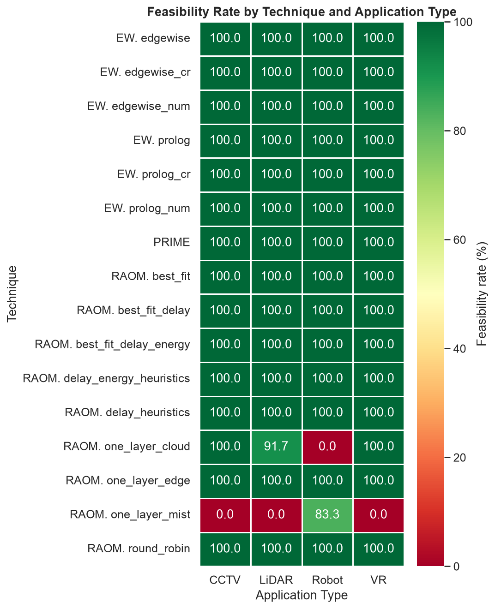
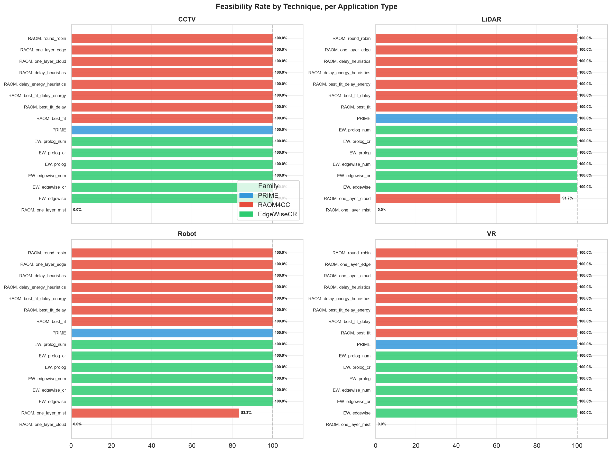
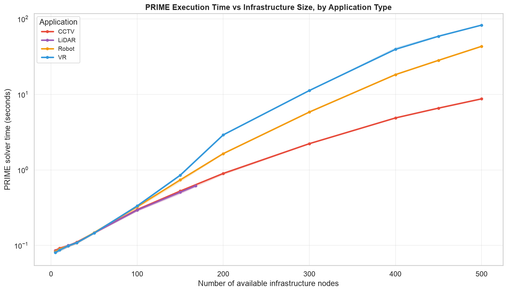
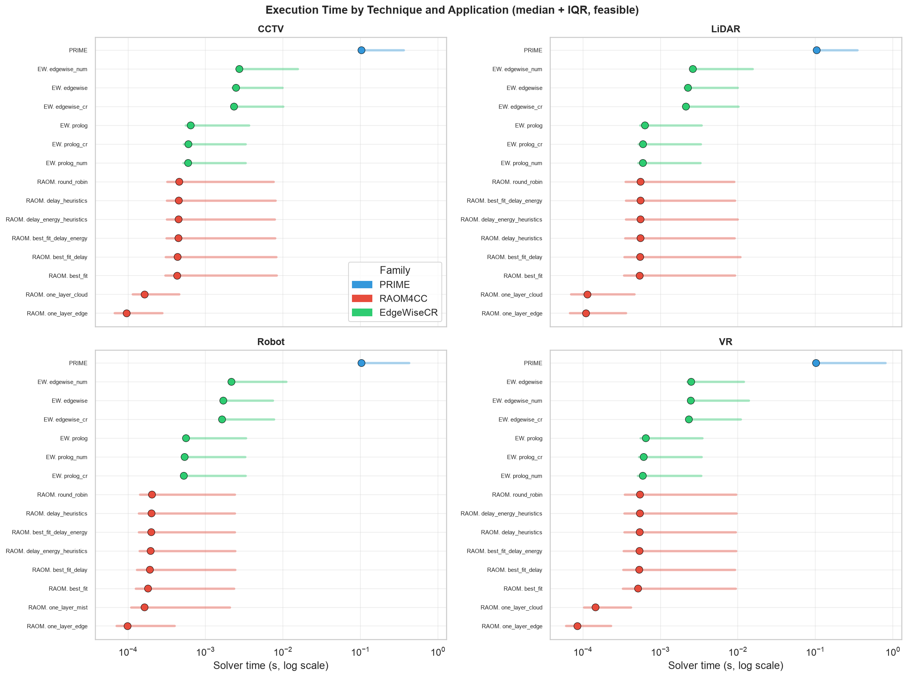
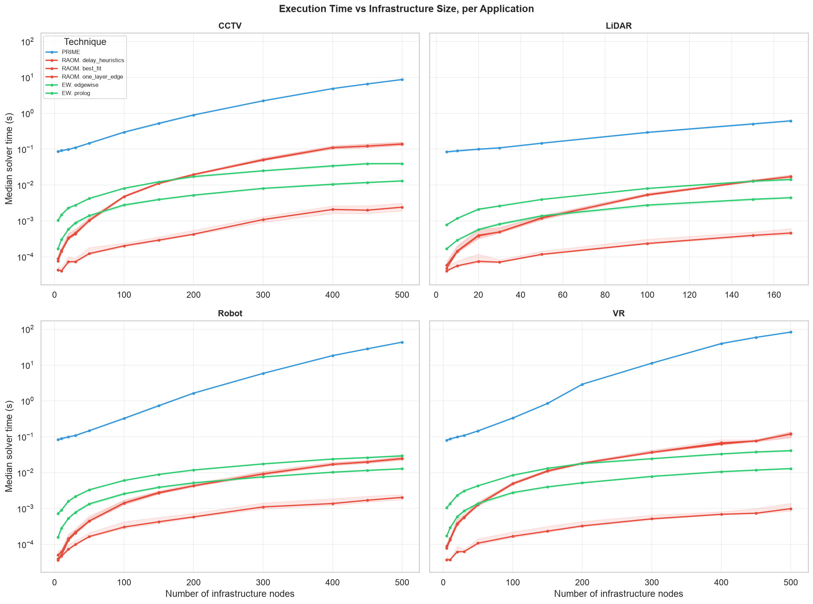
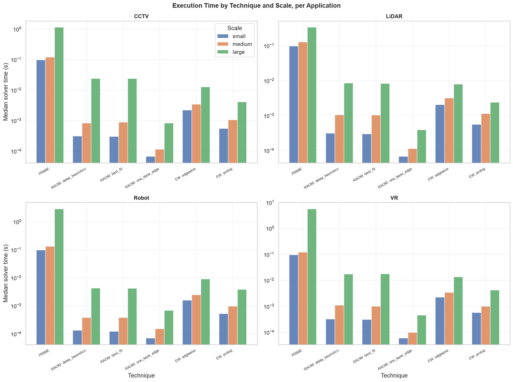
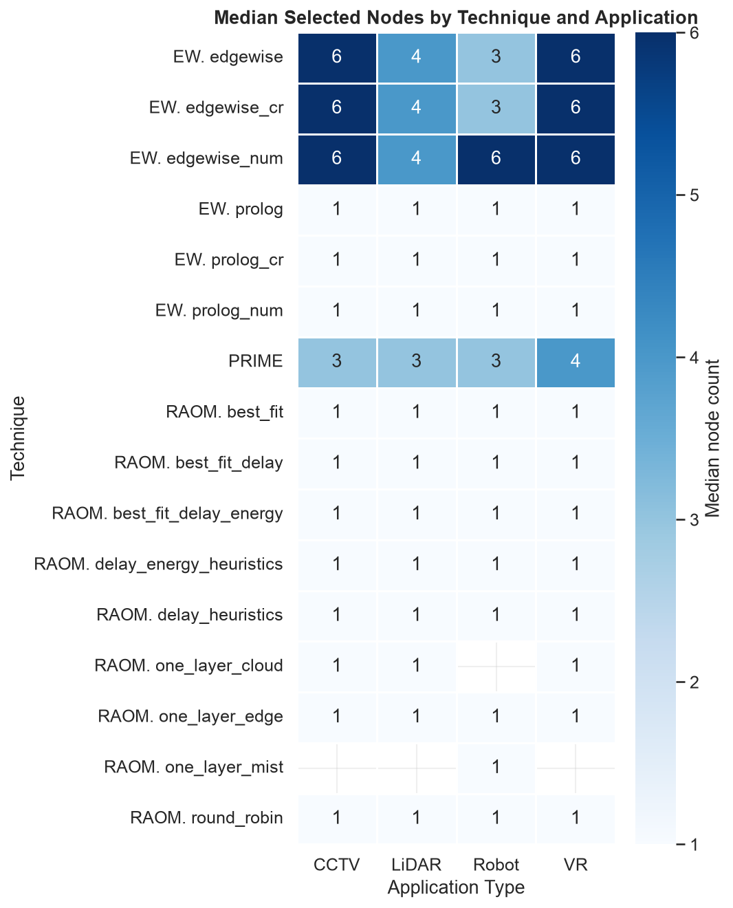
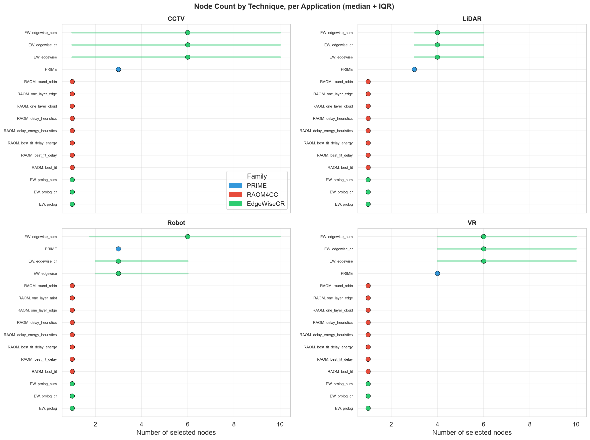
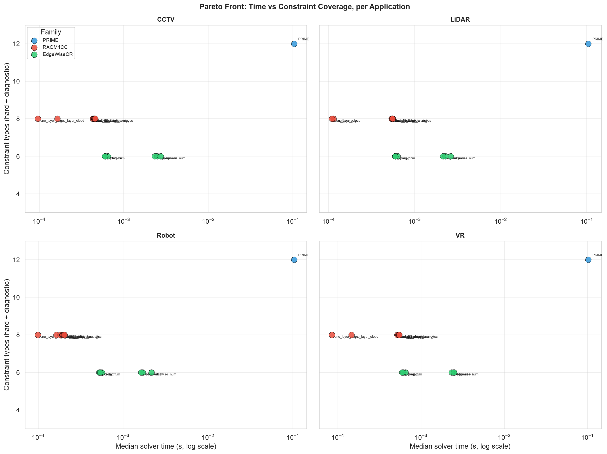
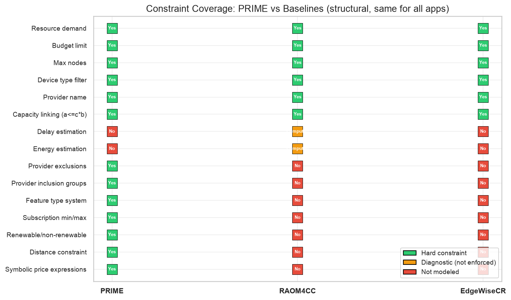

# Results Discussion: PRIME vs RAOM4CC vs EdgeWiseCR

This document presents the statistical comparison of PRIME—the pricing-driven resource
allocation optimiser—against 15 heuristic baselines derived from two reference frameworks:
RAOM4CC (9 variants) and EdgeWiseCR (6 variants). We evaluate all 16 techniques across 9 600
pricing-driven resource allocation scenarios, disaggregated by application type.

Our central finding is that PRIME's execution time varies by up to two orders of magnitude
depending on the workload, whereas baseline performance remains largely application-agnostic.
This divergence invalidates aggregate comparisons and motivates the per-application analysis
that follows.

**Timing note.** PRIME execution times use server-side solver time (`completed_at −
started_at`), excluding HTTP overhead (~1.4 % of wall clock).

**Cost note.** Cost comparison between PRIME and the baselines is not meaningful. The
baselines model only 6 of 12 hard constraint types and may produce solutions that violate
provider exclusions, feature requirements, subscription constraints, and other requirements
that PRIME enforces. Their cost figures reflect incomplete constraint satisfaction and are
not directly comparable.

## 1. Experimental Scope

We generated 9 600 scenarios spanning three infrastructure scales (S, M, L), four
application types (CCTV, VR, Robot, LiDAR), and two variation dimensions (number of clients,
number of devices). Table 1 summarises the parameter ranges.

**Table 1.** Scenarios considered for the experiment. Ranges denote the minimum and maximum
values used to generate four uniformly spaced configurations.

| Scale | Application | Max. Users | Max. Nodes |
|:-----:|:-----------:|:----------:|:----------:|
| S | CCTV   | 20–80    | 5–30 |
| S | VR     | 25–100   | 5–30 |
| S | Robot  | 15–60    | 5–30 |
| S | LiDAR  | 50–200   | 5–30 |
| M | CCTV   | 100–400  | 50–200 |
| M | VR     | 200–800  | 50–200 |
| M | Robot  | 75–300   | 50–200 |
| M | LiDAR  | 500–2000 | 50–200 |
| L | CCTV   | 500–2000  | 300–500 |
| L | VR     | 1500–8000 | 300–500 |
| L | Robot  | 250–1000  | 300–500 |
| L | LiDAR  | 2500–5000 | 300–500 |

Each of the 12 scale–application combinations produces 800 scenarios (400 varying clients,
400 varying devices), yielding 9 600 unique scenario instances evaluated under all 16
techniques for a total of 153 600 data points.

The four application types represent distinct workload profiles in the computing continuum:

- **CCTV** (video surveillance): moderate CPU and storage demands, low latency tolerance,
  medium user counts.
- **VR** (augmented/virtual reality): high GPU demand, strict latency requirements, highest
  user counts at large scale.
- **Robot** (robotic IoT): heterogeneous sensor and actuator requirements, moderate user
  counts, diverse device types.
- **LiDAR** (V2X感知): high data throughput, large user counts but compact infrastructure
  footprints.

## 2. Baseline Grouping

The 15 heuristic baselines originate from two frameworks whose variants differ in candidate
ordering or objective formulation but share a common search structure. We group them into
four categories to reduce presentation complexity without losing analytical granularity.
The justification for each group follows.

**Group A — RAOM4CC `one_layer_*` (3 variants: mist, edge, cloud).** These heuristics
restrict placement to a single infrastructure tier (mist, edge, or cloud). They share an
identical greedy first-fit algorithm and differ only in which layer they target. Their
performance characteristics—feasibility, execution time, node count—are determined by the
layer constraint, not by the ordering heuristic. Grouping is justified because the layer
choice dominates all other algorithmic differences.

**Group B — RAOM4CC advanced heuristics (6 variants: `round_robin`,
`delay_heuristics`, `delay_energy_heuristics`, `best_fit`, `best_fit_delay`,
`best_fit_delay_energy`).** These variants operate over the full multi-layer search space
with feasibility-aware selection. They share the same placement builder and differ only in
the candidate ordering criterion (round-robin, delay-aware, energy-aware, best-fit, or
combinations thereof). Across all 9 600 scenarios, their median execution times fall within
a 2× band (0.18–0.55 ms) and their feasibility rates are identical (100 % for every variant
on every application). The ordering criterion has negligible impact on the metrics we
measure, so we report group-level statistics.

**Group C — EdgeWiseCR greedy / `prolog` (3 variants: `prolog`, `prolog_cr`,
`prolog_num`).** These are greedy bin-packing heuristics that share the same selection
logic and differ only in the objective function (cost, cost + reliability, cost + numerical
penalty). All three produce identical feasibility rates (100 %) and identical median node
counts (1) across all applications. The objective variant does not alter the structural
properties of the solution.

**Group D — EdgeWiseCR MILP / `edgewise` (3 variants: `edgewise`, `edgewise_cr`,
`edgewise_num`).** These are mixed-integer linear programming formulations that share the
same constraint structure and differ only in the objective function. All three achieve 100 %
feasibility and exhibit near-identical execution times (median 1.7–2.7 ms across
applications). As with Group C, the objective variant does not change the solution
structure in ways that our metrics capture.

PRIME stands alone as the fifth technique category. It uses a constraint programming solver
(MiniZinc) that explores the full feasible solution space with 12 hard constraint types,
compared to 6 enforced by all baselines.

## 3. Feasibility Analysis

PRIME and all EdgeWiseCR variants achieve 100 % feasibility across every application type.
The RAOM4CC advanced heuristics (Group B) likewise maintain 100 % feasibility on all four
workloads. The feasibility failures concentrate exclusively in the RAOM4CC `one_layer_*`
group (Group A), and—critically—the failure pattern is **application-dependent**.

Table 2 reports the feasibility rates for the three Group A variants by application.

**Table 2.** Feasibility rate (%) of RAOM4CC single-layer heuristics by application type.

| Variant | CCTV | LiDAR | Robot | VR |
|:--------|:----:|:-----:|:-----:|:--:|
| `one_layer_mist`  | 0.0 | 0.0 | 83.3 | 0.0 |
| `one_layer_edge`  | 100.0 | 100.0 | 100.0 | 100.0 |
| `one_layer_cloud` | 100.0 | 91.7 | 0.0 | 100.0 |

Two patterns emerge. First, `one_layer_mist` fails completely for CCTV, LiDAR, and VR
because mist-tier devices lack the GPU and storage capacity that these workloads demand.
Robot applications, which require heterogeneous sensors and actuators rather than heavy
compute, find some mist devices suitable—hence the partial 83.3 % feasibility. Second,
`one_layer_cloud` exhibits the complementary failure: it achieves 100 % for CCTV and VR
(which benefit from cloud-tier GPU capacity) but collapses to 0 % for Robot, where the
required device types (sensors, actuators) reside at the edge and mist tiers rather than in
cloud data centres. LiDAR shows a partial 91.7 % because some LiDAR scenarios require device
types absent from the cloud tier.

The `one_layer_edge` variant succeeds universally because edge nodes occupy a middle ground
in both capacity and device diversity. This finding has a practical implication: when a
single-tier heuristic is necessary, edge-only placement is the only safe default. The
remaining 13 techniques—PRIME, all EdgeWiseCR variants, and all RAOM4CC advanced
heuristics—select across multiple tiers and never encounter this failure mode.

## 4. Execution Time Analysis

### 4.1 PRIME Scalability by Application Type

PRIME's solver time grows at vastly different rates across the four application types.
At small scale (5–30 infrastructure nodes), all four workloads complete in under 0.16 s
(median 0.098 s), and the differences between applications are negligible. Beyond
approximately 200 nodes, the computational cost diverges sharply.

Table 3 reports PRIME's median and maximum solver time at large scale (300–500 nodes) for
each application.

**Table 3.** PRIME solver-side execution time at large scale, by application type.

| Application | Median (s) | Max (s) | Growth factor vs. small |
|:-----------:|:----------:|:-------:|:-----------------------:|
| LiDAR  | 0.34 | 0.66  | 3.4× |
| CCTV   | 1.15 | 8.88  | 11.7× |
| Robot  | 2.88 | 43.80 | 29.4× |
| VR     | 5.65 | 83.78 | 58.2× |

LiDAR scales best: even at 168 infrastructure nodes (the maximum in its large-scale
configuration), PRIME completes in under 1 s. This is because LiDAR scenarios use compact
infrastructure footprints despite high user counts—the sensing workload generates large data
streams but requires few placement decisions. CCTV shows moderate growth, reaching a
median of 1.15 s and a maximum of 8.88 s at 500 nodes. Robot exhibits steeper growth after
300 nodes, climbing from a median of 1.65 s at 200–300 nodes to 43.4 s at 500+ nodes. VR is
the most computationally demanding workload: its median time rises from 2.9 s at 200–300
nodes to 83.0 s at 500+ nodes—an 83× increase over the small-scale baseline.

The divergence reflects the combinatorial complexity of each workload's constraint structure.
VR scenarios involve the highest user counts (up to 8 000 at large scale), the most diverse
feature requirements, and the tightest latency constraints, producing a constraint network
that the CP solver must explore extensively. LiDAR's compact topology limits the search
space regardless of user count.

### 4.2 Baseline Execution Time (Application-Agnostic)

Unlike PRIME, the 15 baselines exhibit near-constant execution times across application
types. Table 4 reports the median solver time for each baseline group, disaggregated by
application.

**Table 4.** Median execution time (seconds) by technique group and application type,
aggregated over all feasible solutions. This table extends the original runtime comparison
to show per-application variation.

| Technique group | CCTV | LiDAR | Robot | VR | Selected nodes |
|:----------------|:----:|:-----:|:-----:|:--:|:--------------:|
| RAOM4CC `one_layer_*` | 0.00012 | 0.00011 | 0.00013 | 0.00011 | 1–2 |
| RAOM4CC advanced | 0.00045 | 0.00055 | 0.00020 | 0.00053 | 1 |
| EdgeWiseCR greedy (`prolog`) | 0.00062 | 0.00061 | 0.00055 | 0.00062 | 1 |
| EdgeWiseCR MILP (`edgewise`) | 0.00256 | 0.00248 | 0.00202 | 0.00244 | 3–6 |
| **PRIME (overall)** | 0.103 | 0.104 | 0.103 | 0.102 | 3–4 |
| **PRIME (large scale)** | 1.145 | 0.338 | 2.882 | 5.650 | 3–4 |
| **PRIME (max observed)** | 8.877 | 0.672 | 43.801 | 83.781 | 3–4 |

PRIME's execution time at small scale (~0.098 s) is comparable across applications—roughly
200× slower than the fastest baseline (RAOM4CC `one_layer_edge`, 0.000096 s). At large
scale, the gap widens to 949× for LiDAR (the best case) and 1 201× for VR (the worst case).
The baselines' insensitivity to application type is structural: their heuristic and MILP
formulations process a fixed constraint set whose size does not vary with workload
complexity. PRIME, by contrast, must propagate a constraint network whose size and
tightness depend on the number of features, provider exclusions, and subscription
constraints encoded in each application's request.

### 4.3 All Techniques: Time vs Infrastructure Size

The faceted scatter plots confirm that baseline execution times remain flat across
infrastructure sizes for all four applications, while PRIME's curve steepens dramatically
for VR and Robot beyond 200 nodes. EdgeWiseCR MILP (`edgewise`) shows a modest increase on
large topologies (up to 0.065 s at 500 nodes for CCTV), but remains two to three orders of
magnitude faster than PRIME on the same scenarios.

### 4.4 Execution Time by Scenario Scale

The grouped bar charts per application reveal that the small-to-medium transition has
minimal impact on PRIME's time (median 0.098 s → 0.122 s for CCTV), while the medium-to-large
transition produces the dominant cost increase (0.122 s → 1.145 s for CCTV, 0.122 s →
5.650 s for VR). LiDAR is the exception: its large-scale median (0.338 s) barely exceeds
its medium-scale median (0.129 s), confirming that infrastructure size—not user count—is the
primary driver of PRIME's solver cost.

### 4.5 Statistical Tests

Kruskal-Wallis tests confirm significant differences across all 16 techniques for every
application type (CCTV: H = 14 881, p ≈ 0; LiDAR: H = 16 734, p ≈ 0; Robot: H = 14 910,
p ≈ 0; VR: H = 16 162, p ≈ 0). Pairwise Mann-Whitney U tests between PRIME and each
baseline yield p < 0.001 for all 60 comparisons (15 baselines × 4 applications). The effect
sizes are large (r > 0.5) in every case, reflecting the orders-of-magnitude separation
between PRIME and the heuristic baselines.

## 5. Node Selection Analysis

The number of nodes that each technique selects varies by application type, particularly for
PRIME and EdgeWiseCR MILP. Table 5 reports median node counts.

**Table 5.** Median selected nodes by technique group and application type (feasible
solutions only).

| Technique group | CCTV | LiDAR | Robot | VR |
|:----------------|:----:|:-----:|:-----:|:--:|
| RAOM4CC `one_layer_*` | 1 | 1 | 1 | 1 |
| RAOM4CC advanced | 1 | 1 | 1 | 1 |
| EdgeWiseCR greedy | 1 | 1 | 1 | 1 |
| EdgeWiseCR MILP | 6 | 4 | 3 | 6 |
| PRIME | 3 | 3 | 3 | 4 |

All RAOM4CC and EdgeWiseCR greedy variants select a single node regardless of workload,
because their greedy and single-layer strategies co-locate resources on the first feasible
device. EdgeWiseCR MILP selects more nodes on CCTV and VR (median 6) than on LiDAR (4) or
Robot (3), because the MILP formulation distributes demand across many small contributions
when the workload's resource profile benefits from aggregation. PRIME selects 3 nodes for
CCTV, LiDAR, and Robot, and 4 for VR, reflecting the constraint solver's balancing of cost
minimisation against feature coverage and provider exclusion constraints.

The practical trade-off is between management overhead (fewer nodes are simpler to operate)
and resource adequacy (more nodes provide better coverage and lower per-node load). PRIME's
selection of 3–4 nodes represents a middle ground: sufficient to satisfy feature and
exclusion constraints, but compact enough to avoid excessive management complexity.

## 6. Pareto Front: Execution Time vs Constraint Coverage

Each technique is evaluated on two dimensions: median execution time (lower is better) and
hard constraint types enforced (higher is more complete). PRIME enforces 12 of 12 hard
constraint types; all baselines enforce 6 of 12.

The Pareto front shifts rightward for PRIME on VR and Robot (higher solver time), while
remaining near-static for baselines across all four applications. On LiDAR, PRIME occupies
a position close to the Pareto-optimal frontier: its median time (0.104 s) is only 949×
slower than the fastest baseline, and its constraint coverage is double. On VR at large
scale, PRIME's median time (5.65 s) places it far from the frontier, making the constraint
coverage advantage more costly to obtain.

| Constraint | PRIME | RAOM4CC | EdgeWiseCR |
|:-----------|:-----:|:-------:|:----------:|
| Resource demand | Yes | Yes | Yes |
| Budget limit | Yes | Yes | Yes |
| Max nodes | Yes | Yes | Yes |
| Device type filter | Yes | Yes | Yes |
| Provider name | Yes | Yes | Yes |
| Capacity linking | Yes | Yes | Yes |
| Delay estimation | — | Computed | — |
| Energy estimation | — | Computed | — |
| Provider exclusions | **Yes** | No | No |
| Provider inclusion groups | **Yes** | No | No |
| Feature type system | **Yes** | No | No |
| Subscription min/max | **Yes** | No | No |
| Renewable/non-renewable | **Yes** | No | No |
| Distance constraint | **Yes** | No | No |
| Symbolic pricing | **Yes** | No | No |

RAOM4CC computes delay and energy estimations (diagnostic metrics, not enforced as hard
constraints) and uses them as candidate-ordering criteria. EdgeWiseCR does not compute
additional metrics. The six constraints that only PRIME enforces—provider exclusions,
inclusion groups, the feature type system, subscription min/max, renewable/non-renewable
resource tracking, and distance constraints—are the constraints that make solutions
deployable in production. A baseline solution that ignores provider incompatibility is not
deployable, even if it satisfies basic resource demands.

## 7. Solution Completeness

Constraint coverage is a structural property of each technique family and does not vary by
application type. PRIME enforces 12/12 hard constraints (100 %). RAOM4CC enforces 6/12
(50 %) and computes 2 diagnostic metrics. EdgeWiseCR enforces 6/12 (50 %) with no
diagnostic metrics. All three families share the same 6 basic constraints: resource demand,
budget, max nodes, device type, provider name, and capacity linking. The six additional
constraints exclusive to PRIME are the ones that address provider interoperability, feature
requirements, subscription provisioning, and symbolic pricing—concerns that arise in
production deployments but are absent from the baseline formulations.

## 8. Synthesis by Application Type

Table 6 synthesises the per-application results into a compact comparison. For each
application, we report PRIME's large-scale behaviour, the feasibility failures observed in
single-layer baselines, the node selection profile, and the technique recommendation
appropriate to that workload.

**Table 6.** Synthesis of results by application type.

| | CCTV | LiDAR | Robot | VR |
|:---|:-----|:------|:------|:---|
| **PRIME time (large, median)** | 1.15 s | 0.34 s | 2.88 s | 5.65 s |
| **PRIME time (max observed)** | 8.88 s | 0.67 s | 43.80 s | 83.78 s |
| **PRIME nodes (median)** | 3 | 3 | 3 | 4 |
| **Baseline feasibility failure** | `one_layer_mist` (0 %) | `one_layer_mist` (0 %), `one_layer_cloud` (91.7 %) | `one_layer_cloud` (0 %), `one_layer_mist` (83.3 %) | `one_layer_mist` (0 %) |
| **EW MILP nodes (median)** | 6 | 4 | 3 | 6 |
| **PRIME/baseline speed gap** | 1 072× | 949× | 1 045× | 1 201× |
| **Scalability profile** | Moderate | Excellent | Steep after 300 nodes | Steepest after 200 nodes |
| **Recommended for offline planning** | PRIME | PRIME | PRIME (≤300 nodes) | PRIME (≤200 nodes) |
| **Recommended for real-time** | RAOM4CC advanced | RAOM4CC advanced | RAOM4CC advanced (edge tier) | RAOM4CC advanced |

LiDAR is the workload where PRIME's trade-off is most favourable: the solver completes in
under 0.7 s even at maximum scale, making the constraint coverage advantage affordable. VR
is the workload where the trade-off is most strained: at 500 nodes, PRIME's 83.8 s maximum
exceeds the threshold for interactive planning, though it remains acceptable for batch
optimisation. Robot and CCTV occupy intermediate positions, with Robot requiring particular
care above 300 nodes.

## 9. PRIME's Structural Advantages

### 9.1 Established Pricing Formalism

PRIME uses the iPricing model (Protocol Buffers schema), a formalism for SaaS pricing in the
computing continuum. The model represents infrastructure as add-ons with symbolic price
expressions, usage limits, features, and exclusion/inclusion relations. This formalism is
reusable across cloud, edge, and mist scenarios without modification.

### 9.2 Provider Interoperability Constraints

PRIME models `excludes` and `compatible_provider_groups` relations between add-ons. Each
topology in the benchmark contains 20–30 exclusion relations (e.g., OPTUS devices exclude
TELSTRA devices from co-deployment). The solver enforces these relations as hard
constraints. None of the baselines model provider exclusions; a baseline solution may select
incompatible providers together, making it non-deployable.

### 9.3 Feature and Domain Constraints

PRIME models features with a typed system (`FeatureType`: DOMAIN, INTEGRATION, AUTOMATION,
MANAGEMENT, GUARANTEE, SUPPORT, PAYMENT). Features are boolean requirements that selected
nodes must satisfy. The baselines do not model features.

### 9.4 Subscription and Quantity Constraints

PRIME models `SubscriptionConstraints` per add-on: `minQuantity`, `maxQuantity`, and
`quantityStep`. This enables realistic provisioning constraints (e.g., a provider requires a
minimum of 2 nodes to be selected together).

### 9.5 Full Solution Space Exploration

PRIME uses a constraint programming solver (MiniZinc) that explores the full feasible
solution space without heuristic pruning. The baselines use various strategies to reduce the
search space:

| Technique | Search strategy | Optimality guarantee |
|:----------|:----------------|:---------------------|
| PRIME | Full constraint satisfaction | Optimal (CP solver) |
| RAOM4CC advanced | Heuristic ordering + greedy selection | None |
| RAOM4CC `one_layer_*` | Single-tier greedy first-fit | None |
| EdgeWiseCR MILP | Simplified MILP formulation | Optimal of simplified model |
| EdgeWiseCR greedy | Bin-packing heuristic | None |

## 10. Strengths and Weaknesses by Technique Group

### PRIME

| Strengths | Weaknesses |
|:----------|:-----------|
| Full constraint coverage (12/12 types) | Solver time up to 83.8 s (VR, large scale) |
| 100 % feasibility on all applications | Requires Docker infrastructure |
| Optimal solution with certificate | Not suitable for real-time VR/Robot at large scale |
| Provider exclusion/inclusion enforcement | REST API adds ~1.4 % overhead |
| Application-adaptive node selection (3–4 nodes) | |

### EdgeWiseCR MILP (`edgewise` variants)

| Strengths | Weaknesses |
|:----------|:-----------|
| Millisecond execution (2–3 ms median) | Only 6/12 hard constraints |
| 100 % feasibility on all applications | Ignores provider exclusions |
| Optimal of simplified model | Selects 3–6 nodes (higher management overhead) |
| Execution time app-agnostic | Solutions may not be deployable |

### RAOM4CC advanced heuristics (Group B)

| Strengths | Weaknesses |
|:----------|:-----------|
| Sub-millisecond execution (0.2–0.6 ms) | Only 6/12 hard constraints |
| 100 % feasibility for all 6 variants | Computes delay/energy but does not enforce them |
| No external solver dependency | No optimality guarantee |
| Simple to implement | Solutions may not be deployable |

### RAOM4CC `one_layer_*` (Group A)

| Strengths | Weaknesses |
|:----------|:-----------|
| Fastest execution (< 0.1 ms) | Application-dependent feasibility (0–100 %) |
| `one_layer_edge` is universally feasible | `mist` and `cloud` fail on specific workloads |
| Minimal implementation | Only 6/12 hard constraints |
| | Solutions may not be deployable |

### EdgeWiseCR greedy (`prolog` variants)

| Strengths | Weaknesses |
|:----------|:-----------|
| Sub-millisecond execution (0.6 ms median) | Only 6/12 hard constraints |
| 100 % feasibility on all applications | Ignores provider exclusions |
| Simple greedy logic | Always selects 1 node (limited coverage) |
| | No optimality guarantee |

## 11. No Absolute Winner

No single technique dominates across all dimensions and all application types. The
appropriate choice depends on the deployment context, the application workload, and the
infrastructure scale.

| Context | Recommended technique | Rationale |
|:--------|:----------------------|:----------|
| Full constraint enforcement, any app | PRIME | Only technique with 12/12 coverage |
| Offline planning, LiDAR | PRIME | Solver time < 0.7 s even at max scale |
| Offline planning, CCTV (≤300 nodes) | PRIME | Solver time < 1 s, full coverage |
| Offline planning, Robot (≤300 nodes) | PRIME | Solver time < 1.7 s, full coverage |
| Offline planning, VR (≤200 nodes) | PRIME | Solver time < 1 s, full coverage |
| Real-time, any app, basic constraints | RAOM4CC advanced | Sub-ms execution, 100 % feasibility |
| Large-scale, simplified constraints | EdgeWiseCR MILP | 2–3 ms execution, optimal of simplified model |
| Single-tier requirement | RAOM4CC `one_layer_edge` | Only single-tier variant with 100 % feasibility on all apps |

## 12. Recommendations

1. **For production use with real providers:** Use PRIME. Provider exclusion and feature
   constraints are essential for deployable solutions, and no baseline enforces them.

2. **For LiDAR workloads at any scale:** Use PRIME. The solver completes in under 0.7 s
   even at maximum infrastructure size, making the constraint coverage advantage affordable.

3. **For VR or Robot at large scale (>300 nodes):** Use PRIME for offline batch
   optimisation, but consider RAOM4CC advanced heuristics for time-critical re-optimisation.
   Validate heuristic solutions manually against provider exclusions before deployment.

4. **For benchmarking with simplified constraints:** Use EdgeWiseCR MILP as the baseline.
   It provides millisecond execution, 100 % feasibility, and optimality within the simplified
   constraint model.

5. **For real-time re-optimisation on any workload:** Use RAOM4CC advanced heuristics with
   feasibility-aware placement. The sub-millisecond execution enables dynamic
   re-optimisation, but solutions require manual validation against provider exclusions and
   feature requirements.

6. **For single-tier deployment constraints:** Use RAOM4CC `one_layer_edge`. It is the only
   single-layer variant that achieves 100 % feasibility across all four application types.
   Avoid `one_layer_mist` for CCTV, LiDAR, and VR; avoid `one_layer_cloud` for Robot.

7. **For future work:** Investigate hybrid approaches that combine the speed of heuristic
   baselines with the constraint completeness of PRIME. Constraint propagation and
   decomposition techniques could reduce PRIME's solver time on VR and Robot at large scale
   while maintaining full constraint coverage. Application-aware solver configuration—where
   the CP model is simplified for LiDAR (compact topologies) and fully expanded for VR
   (complex constraints)—could yield per-application speedups without sacrificing
   deployability.
