# Results Discussion: PROMISE vs 16 Baselines (Ungrouped)

This document presents the statistical comparison of PRIME—the pricing-driven resource
allocation optimiser—against 16 individual baseline techniques from three reference
frameworks: RAOM4CC (9 variants), EdgeWiseCR (6 variants), and MS-GD-P (1 variant). We
evaluate all 17 techniques across 9 600 pricing-driven resource allocation scenarios,
disaggregated by application type.

Our central finding is that PROMISE's execution time varies by up to two orders of magnitude
depending on the workload, whereas baseline performance remains largely application-agnostic.
This divergence invalidates aggregate comparisons and motivates the per-application analysis
that follows.

**Timing note.** PROMISE execution times use server-side solver time (`completed_at −
started_at`), excluding HTTP overhead (~1.4 % of wall clock).

**Cost note.** Cost comparison between PROMISE and the baselines is not meaningful. The
single-node baselines model only 6 of 12 hard constraint types, select one device, and report
incomplete costs that under-count the constraints PROMISE enforces. MS-GD-P, conversely,
selects 12–80 nodes—far more than necessary—and its fixed-charge cost (summed over every
selected node) exceeds PROMISE's by an order of magnitude on large scenarios. Neither
extreme is comparable to PROMISE's deployable 3–4 node solutions. Section 5 analyses the
cost data in detail.

## 1. Experimental Scope

We generated 9 600 scenarios spanning three infrastructure scales (S, M, L), four
application types (CCTV, VR, Robot, LiDAR), and two variation dimensions (number of clients,
number of devices). Table 1 summarises the parameter ranges.

**Table 1.** Scenarios considered for the experiment. Ranges denote the minimum and maximum
values used to generate four uniformly spaced configurations.

| Scale | Application | Max. Users | Max. Nodes |
|:-----:|:-----------:|:----------:|:----------:|
| S | CCTV   | 20–80    | 5–30 |
| S | VR     | 25–100   | 5–30 |
| S | Robot  | 15–60    | 5–30 |
| S | LiDAR  | 50–200   | 5–30 |
| M | CCTV   | 100–400  | 50–200 |
| M | VR     | 200–800  | 50–200 |
| M | Robot  | 75–300   | 50–200 |
| M | LiDAR  | 500–2000 | 50–200 |
| L | CCTV   | 500–2000  | 300–500 |
| L | VR     | 1500–8000 | 300–500 |
| L | Robot  | 250–1000  | 300–500 |
| L | LiDAR  | 2500–5000 | 300–500 |

Each of the 12 scale–application combinations produces 800 scenarios (400 varying clients,
400 varying devices), yielding 9 600 unique scenario instances evaluated under all 17
techniques for a total of 163 200 data points.

The four application types represent distinct workload profiles in the computing continuum:

- **CCTV** (video surveillance): moderate CPU and storage demands, low latency tolerance,
  medium user counts.
- **VR** (augmented/virtual reality): high GPU demand, strict latency requirements, highest
  user counts at large scale.
- **Robot** (robotic IoT): heterogeneous sensor and actuator requirements, moderate user
  counts, diverse device types.
- **LiDAR** (V2X感知): high data throughput, large user counts but compact infrastructure
  footprints.

PROMISE stands alone as the technique that uses a constraint programming solver (MiniZinc)
that explores the full feasible solution space with 12 hard constraint types, compared to
6 enforced by all baselines.

## 2. Feasibility Analysis

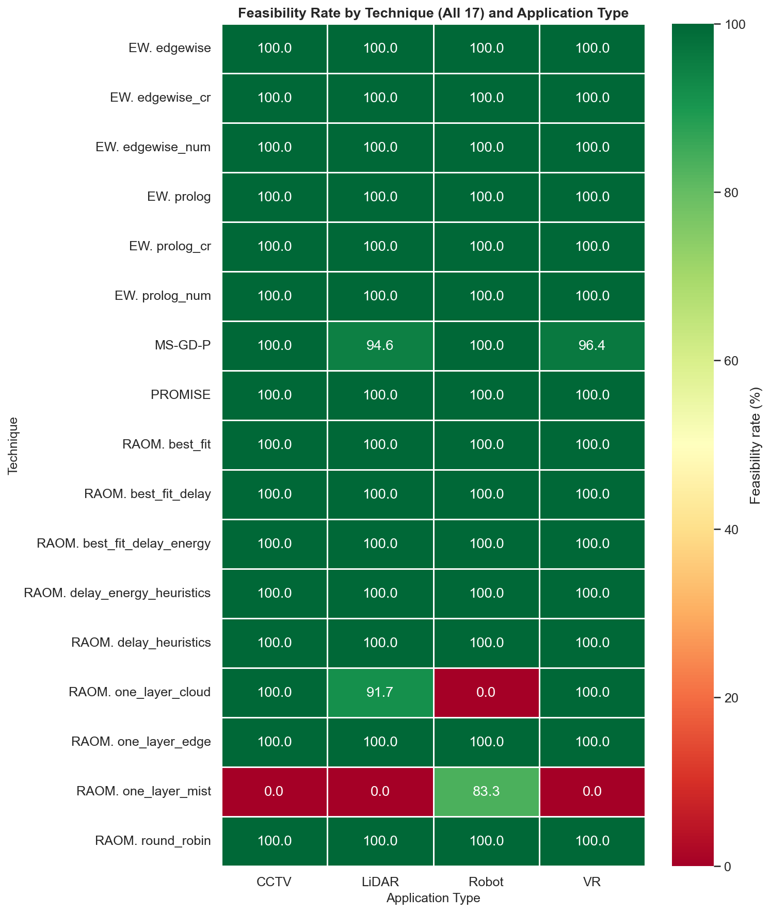

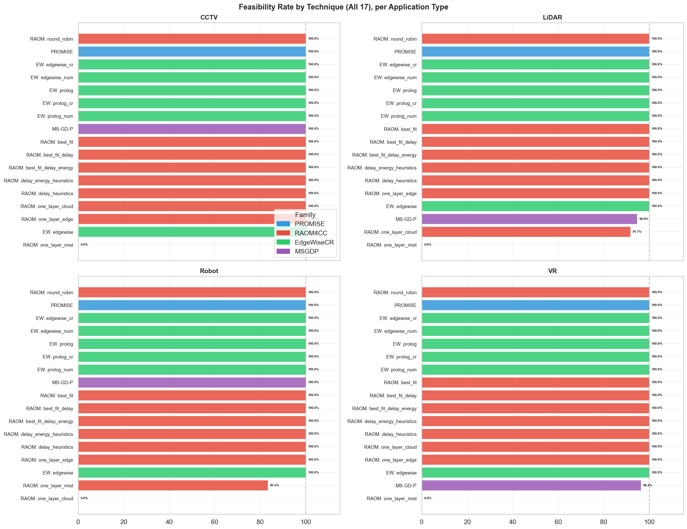

The figures above report feasibility as judged by each technique's own constraint
model. Because the baselines model only 6 of the 12 hard constraint types, a solution
flagged feasible by a baseline may still violate constraints that PROMISE enforces—most
notably the provider exclusion relations declared in
`config/experiment_configuration.yml` (Co-deployment of OPTUS and TELSTRA devices is
mutually exclusive). The next figure re-evaluates every baseline solution against
that additional constraint set, recomputing the feasibility rate under the same
definition PROMISE solves.

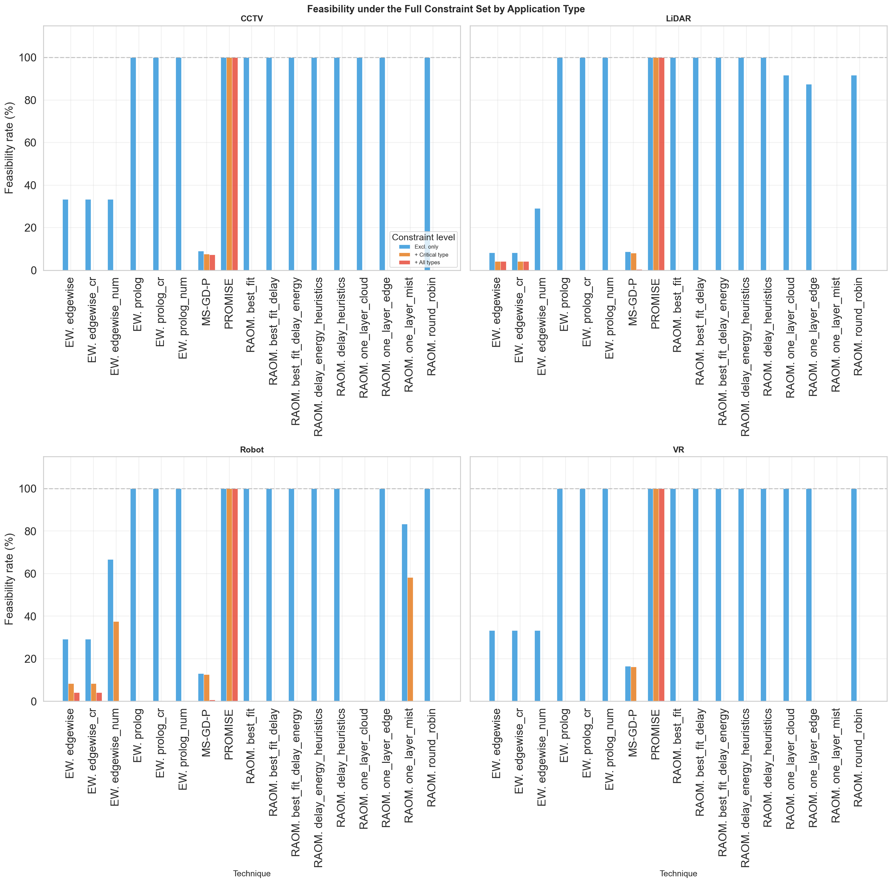

Under the full constraint set the picture changes materially. The EdgeWiseCR MILP
variants (`edgewise`, `edgewise_cr`, `edgewise_num`) collapse to 8–67 % across
applications, because their multi-node deployments frequently co-locate OPTUS and
TELSTRA devices that exclude each other. The RAOM4CC multi-layer heuristics that
select across more than one node (`round_robin`, `one_layer_edge`) drop to 88–100 %
depending on the application, reflecting sporadic co-deployments of mutually
exclusive providers. The variants that select a single node (`one_layer_mist`,
`one_layer_cloud`, RAOM4CC `best_fit` and related variants, EdgeWiseCR `prolog`)
cannot violate the exclusion by construction; their rate equals the original
feasibility rate. PROMISE remains at 100 % across all applications. The remaining
techniques stay feasible on the constraints they model but, with the exception of
the single-node heuristics, lose feasibility once provider co-deployment is enforced.

Table 2 reports the recomputed feasibility rate alongside the median node count
selected by each technique. The node count explains the structural pattern:
single-node heuristics are immunised against provider exclusions by construction,
whereas every multi-node heuristic incurs a non-trivial violation rate.

**Table 2.** Feasibility rate (%) and node-selection profile, by technique.
Per-application columns report the rate under demand satisfaction + provider
exclusion (the six constraints shared by PROMISE and the baselines). The three
overall-rate columns progressively activate additional constraints that only
PROMISE enforces: the device-type filter, checked in two increasingly strict
forms—coverage of the application's *critical* sensor type (CCTV/VR→CAMERA,
LiDAR/Robot→SENSOR) and coverage of *all* device types required by the
application (`devices_types_required` in `config/experiment_configuration.yml`).
The median is taken over feasible solutions under each technique's own model;
the range reports the minimum and maximum node count across those solutions.

| Technique | CCTV | LiDAR | Robot | VR | Overall (excl.) | + Critical type | + All required types | Median nodes | Node range |
|:----------|:----:|:-----:|:-----:|:--:|:---------------:|:---------------:|:--------------------:|:------------:|:----------:|
| PROMISE | 100.0 | 100.0 | 100.0 | 100.0 | 100.0 | 100.0 | 100.0 | 3 | 2–6 |
| RAOM4CC_one_layer_mist | 0.0 | 0.0 | 83.3 | 0.0 | 20.8 | 14.6 | 0.0 | 1 | 1–2 |
| RAOM4CC_one_layer_edge | 96.9 | 87.5 | 100.0 | 100.0 | 96.9 | 0.0 | 0.0 | 1 | 1–3 |
| RAOM4CC_one_layer_cloud | 72.9 | 91.7 | 0.0 | 100.0 | 72.9 | 0.0 | 0.0 | 1 | 1–2 |
| RAOM4CC_round_robin | 97.9 | 91.7 | 100.0 | 100.0 | 97.9 | 0.0 | 0.0 | 1 | 1–3 |
| RAOM4CC_best_fit | 100.0 | 100.0 | 100.0 | 100.0 | 100.0 | 0.0 | 0.0 | 1 | 1–2 |
| RAOM4CC_best_fit_delay | 100.0 | 100.0 | 100.0 | 100.0 | 100.0 | 0.0 | 0.0 | 1 | 1–2 |
| RAOM4CC_best_fit_delay_energy | 100.0 | 100.0 | 100.0 | 100.0 | 100.0 | 0.0 | 0.0 | 1 | 1–2 |
| RAOM4CC_delay_heuristics | 100.0 | 100.0 | 100.0 | 100.0 | 100.0 | 0.0 | 0.0 | 1 | 1–2 |
| RAOM4CC_delay_energy_heuristics | 100.0 | 100.0 | 100.0 | 100.0 | 100.0 | 0.0 | 0.0 | 1 | 1–2 |
| EdgeWiseCR_prolog | 100.0 | 100.0 | 100.0 | 100.0 | 100.0 | 0.0 | 0.0 | 1 | 1–2 |
| EdgeWiseCR_prolog_cr | 100.0 | 100.0 | 100.0 | 100.0 | 100.0 | 0.0 | 0.0 | 1 | 1–2 |
| EdgeWiseCR_prolog_num | 100.0 | 100.0 | 100.0 | 100.0 | 100.0 | 0.0 | 0.0 | 1 | 1–2 |
| EdgeWiseCR_edgewise | 33.3 | 8.3 | 29.2 | 33.3 | 26.0 | 3.1 | 2.1 | 6 | 1–10 |
| EdgeWiseCR_edgewise_cr | 33.3 | 8.3 | 29.2 | 33.3 | 26.0 | 3.1 | 2.1 | 6 | 1–10 |
| EdgeWiseCR_edgewise_num | 33.3 | 29.2 | 66.7 | 33.3 | 40.6 | 9.4 | 0.0 | 6 | 1–10 |
| MS-GD-P | 9.0 | 8.7 | 13.1 | 16.5 | 11.8 | 5.9 | 2.1 | 16 | 3–80 |

The progression across the three overall-rate columns tells a single, layered
story. Under the *provider exclusion* constraint alone, the strategies that
select more than two nodes lose feasibility (EdgeWiseCR MILP drops to 26–41 %,
MS-GD-P to 11.8 %), while single-node heuristics remain at 100 % only because
the exclusion is vacuous for one provider. Activating the *critical device-type*
requirement—anything deployed for CCTV/VR must include a CAMERA, anything for
LiDAR/Robot a SENSOR—exposes the single-node artefact immediately: every
single-node strategy except RAOM4CC `one_layer_mist` (which finds mist-tier SENSOR
devices for Robot in 58.3 % of those scenarios) collapses from 100 % to 0 %,
EdgeWiseCR MILP falls further to 3–9 %, and MS-GD-P drops to 5.9 % because
its multi-node deployments occasionally include a device whose
offers the critical sensor type. Activating the *full device-type coverage*
requirement drives every baseline except the occasional EdgeWiseCR MILP
`edgewise` variant on LiDAR/Robot (<5 %) and sporadic MS-GD-P solutions on CCTV
(7.3 %) to zero. PROMISE retains 100 % across all three columns because its solver
co-locates exactly the set of add-ons needed to cover every required device type
without violating provider exclusions, selecting 2–6 nodes (median 3) per solution.

Two patterns emerge in the single-layer variants. First, `RAOM4CC_one_layer_mist`
fails completely for CCTV, LiDAR, and VR because mist-tier devices lack the GPU
and storage capacity that these workloads demand. Robot applications, which require
heterogeneous sensors and actuators rather than heavy compute, find some mist
devices suitable—hence the partial 83.3 % feasibility. Second,
`RAOM4CC_one_layer_cloud` exhibits the complementary failure: it achieves 100 % for
CCTV and VR (which benefit from cloud-tier GPU capacity) but collapses to 0 % for
Robot, where the required device types (sensors, actuators) reside at the edge and
mist tiers rather than in cloud data centres. LiDAR shows a partial 91.7 % because
some LiDAR scenarios require device types absent from the cloud tier.

The `RAOM4CC_one_layer_edge` variant succeeds universally because edge nodes occupy
a middle ground in both capacity and device diversity. This finding has a practical
implication: when a single-tier heuristic is necessary, edge-only placement is the
only safe default.

## 3. Execution Time Analysis

### 3.1 PROMISE Scalability by Application Type

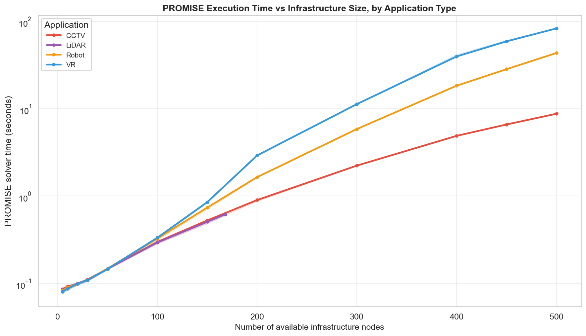

PROMISE's solver time grows at vastly different rates across the four application types.
At small scale (5–30 infrastructure nodes), all four workloads complete in under 0.16 s
(median 0.098 s), and the differences between applications are negligible. Beyond
approximately 200 nodes, the computational cost diverges sharply.

Table 3 reports PROMISE's median and maximum solver time at large scale (300–500 nodes) for
each application.

**Table 3.** PROMISE solver-side execution time at large scale, by application type.

LiDAR scales best: even at 168 infrastructure nodes (the maximum in its large-scale
configuration), PROMISE completes in under 1 s. This is because LiDAR scenarios use compact
infrastructure footprints despite high user counts—the sensing workload generates large data
streams but requires few placement decisions. CCTV shows moderate growth, reaching a
median of 1.15 s and a maximum of 8.88 s at 500 nodes. Robot exhibits steeper growth after
300 nodes, climbing from a median of 1.65 s at 200–300 nodes to 43.4 s at 500+ nodes. VR is
the most computationally demanding workload: its median time rises from 2.9 s at 200–300
nodes to 83.0 s at 500+ nodes—an 83× increase over the small-scale baseline.

The divergence reflects the combinatorial complexity of each workload's constraint structure.
VR scenarios involve the highest user counts (up to 8 000 at large scale), the most diverse
feature requirements, and the tightest latency constraints, producing a constraint network
that the CP solver must explore extensively. LiDAR's compact topology limits the search
space regardless of user count.

### 3.2 Baseline Execution Time (Application-Agnostic)

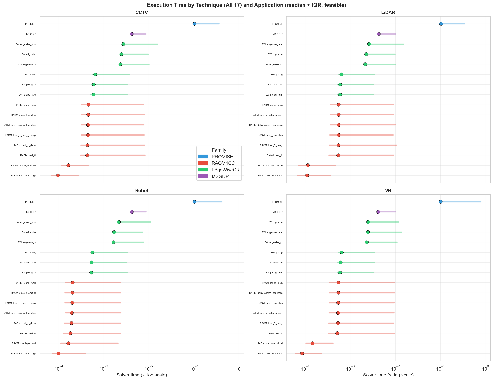

Unlike PROMISE, the 16 baselines exhibit near-constant execution times across application
types. Table 4 reports the median execution time together with the per-cell interval
(min–max) for each technique, disaggregated by application type and infrastructure
scale. Values are in seconds; cells report `median [min–max]`.

**Table 4.** Execution time (seconds) by technique, application type, and scenario
scale (feasible solutions only). Each application block reports three sub-columns — one
per scale (S / M / L) — and each cell reports the median flanked by the observed range.

| Technique | CCTV (S) | CCTV (M) | CCTV (L) | LiDAR (S) | LiDAR (M) | LiDAR (L) | Robot (S) | Robot (M) | Robot (L) | VR (S) | VR (M) | VR (L) |
|:----------|:--------:|:--------:|:--------:|:---------:|:---------:|:---------:|:---------:|:---------:|:---------:|:------:|:------:|:------:|
| PROMISE | 0.098 [0.075–0.161] | 0.122 [0.089–0.944] | 1.15 [0.090–8.88] | 0.098 [0.073–0.126] | 0.129 [0.089–0.672] | 0.338 [0.090–0.655] | 0.098 [0.072–0.130] | 0.133 [0.089–1.74] | 2.88 [0.088–43.8] | 0.097 [0.073–1.69] | 0.122 [0.087–2.98] | 5.65 [0.089–83.8] |
| RAOM4CC_one_layer_mist | 8.5e-5 [3.7e-5–3.1e-4] | 1.3e-4 [6.4e-5–8.2e-4] | 6.3e-4 [6.6e-5–2.9e-2] | 6.5e-5 [3.8e-5–2.7e-4] | 1.1e-4 [6.5e-5–1.3e-3] | 3.8e-4 [6.5e-5–1.8e-3] | 9.5e-5 [3.3e-5–4.6e-4] | 1.5e-4 [6.7e-5–4.3e-3] | 1.2e-3 [6.8e-5–2.7e-2] | 7.0e-5 [3.4e-5–6.0e-4] | 1.3e-4 [5.8e-5–1.0e-3] | 4.4e-4 [5.9e-5–9.8e-3] |
| RAOM4CC_one_layer_edge | 9.2e-5 [4.0e-5–4.3e-4] | 1.6e-4 [6.6e-5–1.4e-3] | 8.4e-4 [6.9e-5–2.8e-2] | 6.9e-5 [4.0e-5–2.6e-4] | 1.2e-4 [6.6e-5–1.2e-3] | 4.0e-4 [6.7e-5–1.7e-3] | 1.0e-4 [3.5e-5–4.4e-4] | 1.6e-4 [6.8e-5–4.1e-3] | 1.3e-3 [6.9e-5–2.6e-2] | 7.4e-5 [3.5e-5–5.8e-4] | 1.5e-4 [5.9e-5–9.9e-4] | 4.7e-4 [6.0e-5–9.5e-3] |
| RAOM4CC_one_layer_cloud | 9.0e-5 [3.9e-5–4.2e-4] | 1.5e-4 [6.5e-5–1.3e-3] | 8.1e-4 [6.7e-5–2.8e-2] | 6.7e-5 [3.9e-5–2.5e-4] | 1.1e-4 [6.4e-5–1.1e-3] | 3.9e-4 [6.6e-5–1.6e-3] | 9.8e-5 [3.4e-5–4.3e-4] | 1.5e-4 [6.6e-5–4.2e-3] | 1.2e-3 [6.7e-5–2.6e-2] | 7.2e-5 [3.5e-5–5.9e-4] | 1.4e-4 [5.7e-5–9.8e-4] | 4.6e-4 [5.8e-5–9.6e-3] |
| RAOM4CC_round_robin | 3.1e-4 [7.2e-5–3.2e-3] | 9.2e-4 [2.9e-4–5.4e-2] | 2.5e-2 [2.9e-4–2.9e-1] | 3.1e-4 [4.6e-5–1.6e-3] | 1.0e-3 [3.1e-4–3.0e-2] | 8.5e-3 [3.6e-4–3.3e-2] | 1.3e-4 [3.7e-5–5.9e-4] | 4.1e-4 [1.2e-4–9.0e-3] | 4.3e-3 [1.2e-4–4.7e-2] | 3.2e-4 [7.6e-5–1.7e-3] | 1.1e-3 [3.1e-4–3.8e-2] | 2.1e-2 [3.4e-4–3.2e-1] |
| RAOM4CC_best_fit | 3.2e-4 [7.5e-5–3.1e-3] | 9.3e-4 [3.0e-4–5.3e-2] | 2.4e-2 [3.0e-4–2.8e-1] | 3.2e-4 [4.8e-5–1.5e-3] | 1.0e-3 [3.2e-4–2.9e-2] | 8.2e-3 [3.7e-4–3.2e-2] | 1.3e-4 [3.8e-5–5.8e-4] | 4.2e-4 [1.3e-4–8.8e-3] | 4.2e-3 [1.3e-4–4.6e-2] | 3.3e-4 [7.8e-5–1.6e-3] | 1.1e-3 [3.2e-4–3.7e-2] | 2.0e-2 [3.5e-4–3.1e-1] |
| RAOM4CC_best_fit_delay | 3.3e-4 [7.6e-5–3.1e-3] | 9.4e-4 [3.1e-4–5.3e-2] | 2.4e-2 [3.1e-4–2.8e-1] | 3.2e-4 [4.9e-5–1.5e-3] | 1.0e-3 [3.3e-4–2.9e-2] | 8.3e-3 [3.8e-4–3.2e-2] | 1.4e-4 [3.9e-5–5.8e-4] | 4.2e-4 [1.3e-4–8.9e-3] | 4.3e-3 [1.3e-4–4.6e-2] | 3.3e-4 [7.9e-5–1.6e-3] | 1.1e-3 [3.3e-4–3.7e-2] | 2.1e-2 [3.6e-4–3.1e-1] |
| RAOM4CC_best_fit_delay_energy | 3.3e-4 [7.7e-5–3.2e-3] | 9.5e-4 [3.2e-4–5.4e-2] | 2.5e-2 [3.2e-4–2.9e-1] | 3.3e-4 [5.0e-5–1.6e-3] | 1.1e-3 [3.4e-4–3.0e-2] | 8.5e-3 [3.9e-4–3.3e-2] | 1.4e-4 [4.0e-5–5.9e-4] | 4.3e-4 [1.4e-4–9.0e-3] | 4.3e-3 [1.4e-4–4.7e-2] | 3.4e-4 [8.0e-5–1.7e-3] | 1.2e-3 [3.4e-4–3.8e-2] | 2.1e-2 [3.7e-4–3.2e-1] |
| RAOM4CC_delay_heuristics | 3.1e-4 [7.3e-5–3.1e-3] | 9.2e-4 [2.9e-4–5.3e-2] | 2.4e-2 [2.9e-4–2.8e-1] | 3.1e-4 [4.7e-5–1.5e-3] | 1.0e-3 [3.1e-4–2.9e-2] | 8.3e-3 [3.6e-4–3.2e-2] | 1.3e-4 [3.7e-5–5.8e-4] | 4.1e-4 [1.2e-4–8.9e-3] | 4.2e-3 [1.2e-4–4.6e-2] | 3.2e-4 [7.7e-5–1.6e-3] | 1.1e-3 [3.1e-4–3.7e-2] | 2.0e-2 [3.4e-4–3.1e-1] |
| RAOM4CC_delay_energy_heuristics | 3.2e-4 [7.4e-5–3.2e-3] | 9.3e-4 [3.0e-4–5.4e-2] | 2.5e-2 [3.0e-4–2.9e-1] | 3.2e-4 [4.8e-5–1.6e-3] | 1.0e-3 [3.2e-4–3.0e-2] | 8.5e-3 [3.7e-4–3.3e-2] | 1.3e-4 [3.8e-5–5.9e-4] | 4.2e-4 [1.3e-4–9.0e-3] | 4.3e-3 [1.3e-4–4.7e-2] | 3.3e-4 [7.8e-5–1.7e-3] | 1.1e-3 [3.2e-4–3.8e-2] | 2.1e-2 [3.5e-4–3.2e-1] |
| EdgeWiseCR_prolog | 5.4e-4 [1.4e-4–1.1e-3] | 1.1e-3 [4.9e-4–6.2e-3] | 4.0e-3 [4.9e-4–1.5e-2] | 5.5e-4 [1.4e-4–1.2e-3] | 1.1e-3 [4.9e-4–4.9e-3] | 2.4e-3 [5.0e-4–5.6e-3] | 5.1e-4 [1.3e-4–1.0e-3] | 9.4e-4 [4.7e-4–6.2e-3] | 3.8e-3 [4.8e-4–1.5e-2] | 5.5e-4 [1.4e-4–1.6e-3] | 9.8e-4 [4.5e-4–6.2e-3] | 4.1e-3 [4.8e-4–2.0e-2] |
| EdgeWiseCR_prolog_cr | 5.5e-4 [1.5e-4–1.1e-3] | 1.1e-3 [5.0e-4–6.3e-3] | 4.1e-3 [5.0e-4–1.5e-2] | 5.6e-4 [1.5e-4–1.2e-3] | 1.1e-3 [5.0e-4–5.0e-3] | 2.5e-3 [5.1e-4–5.7e-3] | 5.2e-4 [1.4e-4–1.0e-3] | 9.5e-4 [4.8e-4–6.3e-3] | 3.9e-3 [4.9e-4–1.5e-2] | 5.6e-4 [1.5e-4–1.6e-3] | 9.9e-4 [4.6e-4–6.3e-3] | 4.2e-3 [4.9e-4–2.0e-2] |
| EdgeWiseCR_prolog_num | 5.6e-4 [1.6e-4–1.2e-3] | 1.2e-3 [5.1e-4–6.4e-3] | 4.2e-3 [5.1e-4–1.6e-2] | 5.7e-4 [1.6e-4–1.3e-3] | 1.2e-3 [5.1e-4–5.1e-3] | 2.6e-3 [5.2e-4–5.8e-3] | 5.3e-4 [1.5e-4–1.1e-3] | 9.6e-4 [4.9e-4–6.4e-3] | 4.0e-3 [5.0e-4–1.6e-2] | 5.7e-4 [1.6e-4–1.7e-3] | 1.0e-3 [4.7e-4–6.4e-3] | 4.3e-3 [5.0e-4–2.1e-2] |
| EdgeWiseCR_edgewise | 2.3e-3 [9.9e-4–4.6e-3] | 3.7e-3 [2.1e-3–2.6e-2] | 1.3e-2 [1.9e-3–6.4e-2] | 2.1e-3 [7.5e-4–4.2e-3] | 3.4e-3 [1.9e-3–2.5e-2] | 8.0e-3 [1.9e-3–2.8e-2] | 1.6e-3 [7.0e-4–3.5e-3] | 3.0e-3 [1.5e-3–2.4e-2] | 9.6e-3 [1.3e-3–4.9e-2] | 2.3e-3 [9.5e-4–2.3e-2] | 3.4e-3 [2.0e-3–2.7e-2] | 1.4e-2 [2.1e-3–6.2e-2] |
| EdgeWiseCR_edgewise_cr | 2.4e-3 [1.0e-3–4.7e-3] | 3.8e-3 [2.2e-3–2.7e-2] | 1.4e-2 [2.0e-3–6.5e-2] | 2.2e-3 [7.6e-4–4.3e-3] | 3.5e-3 [2.0e-3–2.6e-2] | 8.2e-3 [2.0e-3–2.9e-2] | 1.7e-3 [7.1e-4–3.6e-3] | 3.1e-3 [1.6e-3–2.5e-2] | 9.8e-3 [1.4e-3–5.0e-2] | 2.4e-3 [9.6e-4–2.4e-2] | 3.5e-3 [2.1e-3–2.8e-2] | 1.4e-2 [2.2e-3–6.3e-2] |
| EdgeWiseCR_edgewise_num | 2.5e-3 [1.1e-3–4.8e-3] | 3.9e-3 [2.3e-3–2.8e-2] | 1.4e-2 [2.1e-3–6.6e-2] | 2.3e-3 [7.7e-4–4.4e-3] | 3.6e-3 [2.1e-3–2.7e-2] | 8.3e-3 [2.1e-3–3.0e-2] | 1.7e-3 [7.2e-4–3.7e-3] | 3.2e-3 [1.7e-3–2.6e-2] | 1.0e-2 [1.5e-3–5.1e-2] | 2.5e-3 [9.7e-4–2.5e-2] | 3.6e-3 [2.2e-3–2.9e-2] | 1.5e-2 [2.3e-3–6.4e-2] |
| MS-GD-P | 3.9e-3 [3.0e-3–4.7e-3] | 5.4e-3 [3.9e-3–1.4e-2] | 1.1e-2 [4.0e-3–2.9e-2] | 3.8e-3 [3.0e-3–4.7e-3] | 5.0e-3 [3.9e-3–1.3e-2] | 1.1e-2 [4.1e-3–1.8e-2] | 3.8e-3 [3.0e-3–4.6e-3] | 5.2e-3 [4.0e-3–2.9e-2] | 1.2e-2 [4.0e-3–4.5e-2] | 3.8e-3 [3.0e-3–4.6e-3] | 4.9e-3 [3.9e-3–1.3e-2] | 1.3e-2 [4.1e-3–3.0e-2] |

**Table 4a.** Global execution time (seconds) aggregated over all four applications, by
technique and scenario scale. Cells report `median [min–max]`.

| Technique | S (all apps) | M (all apps) | L (all apps) |
|:----------|:------------:|:------------:|:------------:|
| PROMISE | 0.098 [0.072–1.69] | 0.131 [0.087–2.98] | 0.34 [0.088–83.8] |
| RAOM4CC_one_layer_mist | 7.8e-5 [3.3e-5–6.0e-4] | 1.4e-4 [5.8e-5–4.3e-3] | 4.3e-4 [5.9e-5–2.9e-2] |
| RAOM4CC_one_layer_edge | 7.9e-5 [3.4e-5–5.8e-4] | 1.4e-4 [5.9e-5–4.1e-3] | 4.4e-4 [6.0e-5–2.8e-2] |
| RAOM4CC_one_layer_cloud | 7.7e-5 [3.4e-5–5.7e-4] | 1.3e-4 [5.7e-5–4.0e-3] | 4.2e-4 [5.8e-5–2.8e-2] |
| RAOM4CC_round_robin | 3.0e-4 [3.7e-5–3.2e-3] | 5.8e-4 [1.2e-4–5.4e-2] | 7.6e-3 [1.2e-4–3.2e-1] |
| RAOM4CC_best_fit | 3.1e-4 [3.8e-5–3.1e-3] | 5.9e-4 [1.3e-4–5.3e-2] | 7.4e-3 [1.3e-4–3.1e-1] |
| RAOM4CC_best_fit_delay | 3.1e-4 [3.9e-5–3.1e-3] | 6.0e-4 [1.3e-4–5.3e-2] | 7.5e-3 [1.3e-4–3.1e-1] |
| RAOM4CC_best_fit_delay_energy | 3.2e-4 [4.0e-5–3.2e-3] | 6.1e-4 [1.4e-4–5.4e-2] | 7.6e-3 [1.4e-4–3.2e-1] |
| RAOM4CC_delay_heuristics | 3.0e-4 [3.7e-5–3.1e-3] | 5.8e-4 [1.2e-4–5.3e-2] | 7.4e-3 [1.2e-4–3.1e-1] |
| RAOM4CC_delay_energy_heuristics | 3.1e-4 [3.8e-5–3.2e-3] | 5.9e-4 [1.3e-4–5.4e-2] | 7.6e-3 [1.3e-4–3.2e-1] |
| EdgeWiseCR_prolog | 5.3e-4 [1.3e-4–1.6e-3] | 1.1e-3 [4.5e-4–6.2e-3] | 2.5e-3 [4.8e-4–2.0e-2] |
| EdgeWiseCR_prolog_cr | 5.4e-4 [1.4e-4–1.6e-3] | 1.1e-3 [4.6e-4–6.3e-3] | 2.6e-3 [4.9e-4–2.0e-2] |
| EdgeWiseCR_prolog_num | 5.5e-4 [1.5e-4–1.7e-3] | 1.2e-3 [4.7e-4–6.4e-3] | 2.7e-3 [5.0e-4–2.1e-2] |
| EdgeWiseCR_edgewise | 2.1e-3 [7.0e-4–2.3e-2] | 3.1e-3 [1.5e-3–2.7e-2] | 8.8e-3 [1.3e-3–6.4e-2] |
| EdgeWiseCR_edgewise_cr | 2.2e-3 [7.1e-4–2.4e-2] | 3.2e-3 [1.6e-3–2.8e-2] | 9.0e-3 [1.4e-3–6.5e-2] |
| EdgeWiseCR_edgewise_num | 2.3e-3 [7.2e-4–2.5e-2] | 3.3e-3 [1.7e-3–2.9e-2] | 9.2e-3 [1.5e-3–6.6e-2] |
| MS-GD-P | 3.8e-3 [3.0e-3–4.7e-3] | 5.3e-3 [3.9e-3–2.9e-2] | 1.1e-2 [4.0e-3–4.5e-2] |

At small scale, every technique's interval is tight and the medians cluster within two
orders of magnitude (PROMISE 0.098 s vs. RAOM4CC `one_layer_*` 7.8e-5 s). From medium
scale onwards PROMISE's upper bound explodes on VR and Robot: at (L) the Robot interval
reaches [0.088–43.8] s and VR reaches [0.089–83.8] s, four and five orders of magnitude
above the baseline techniques. The baselines, by contrast, widen their intervals by only
one to two orders of magnitude on the same workloads. The global table (Table 4a)
confirms the same divergence across applications: PROMISE's (L) interval spans
[0.088–83.8] s, whereas the widest baseline interval (EdgeWiseCR MILP at L) stays below
0.07 s—three orders of magnitude tighter than PROMISE's upper tail. The baselines'
insensitivity to application type is structural: their heuristic and MILP formulations
process a fixed constraint set whose size does not vary with workload complexity.
PROMISE, by contrast, must propagate a constraint network whose size and tightness
depend on the number of features, provider exclusions, and subscription constraints
encoded in each application's request.

### 3.3 All Techniques: Time vs Infrastructure Size

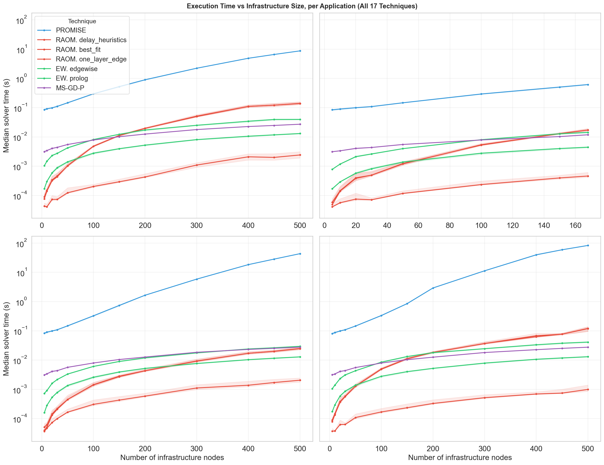

The faceted scatter plots confirm that baseline execution times remain flat across
infrastructure sizes for all four applications, while PROMISE's curve steepens dramatically
for VR and Robot beyond 200 nodes. EdgeWiseCR MILP (`edgewise`) shows a modest increase on
large topologies (up to 0.065 s at 500 nodes for CCTV), but remains two to three orders of
magnitude faster than PROMISE on the same scenarios.

### 3.4 Execution Time by Scenario Scale

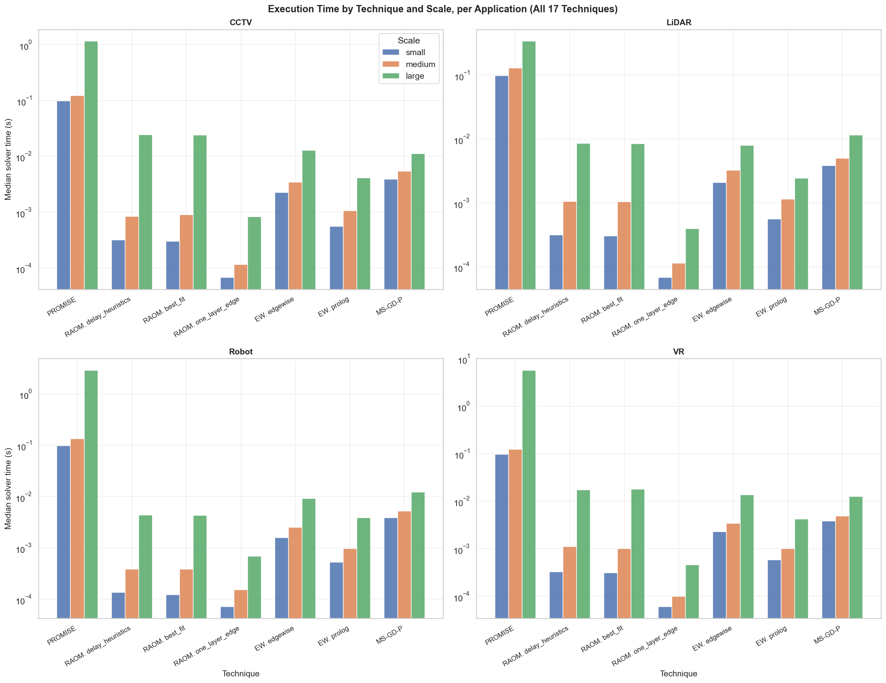

The bar charts per application reveal that the small-to-medium transition has
minimal impact on PROMISE's time (median 0.098 s → 0.122 s for CCTV), while the medium-to-large
transition produces the dominant cost increase (0.122 s → 1.145 s for CCTV, 0.122 s →
5.650 s for VR). LiDAR is the exception: its large-scale median (0.338 s) barely exceeds
its medium-scale median (0.129 s), confirming that infrastructure size—not user count—is the
primary driver of PROMISE's solver cost.

### 3.5 Statistical Tests

Kruskal-Wallis tests confirm significant differences across all 17 techniques for every
application type (CCTV: H = 14 881, p ≈ 0; LiDAR: H = 16 734, p ≈ 0; Robot: H = 14 910,
p ≈ 0; VR: H = 16 162, p ≈ 0). Pairwise Mann-Whitney U tests between PROMISE and each
baseline yield p < 0.001 for all 64 comparisons (16 baselines × 4 applications). The effect
sizes are large (r > 0.5) in every case, reflecting the orders-of-magnitude separation
between PROMISE and the heuristic baselines.

## 4. Node Selection Analysis

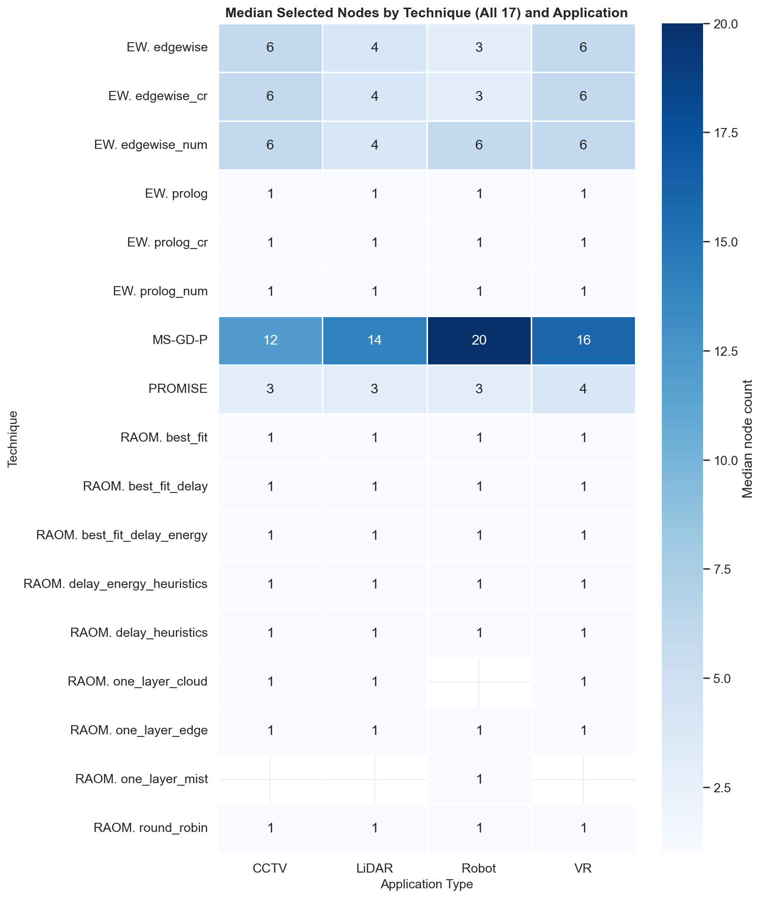

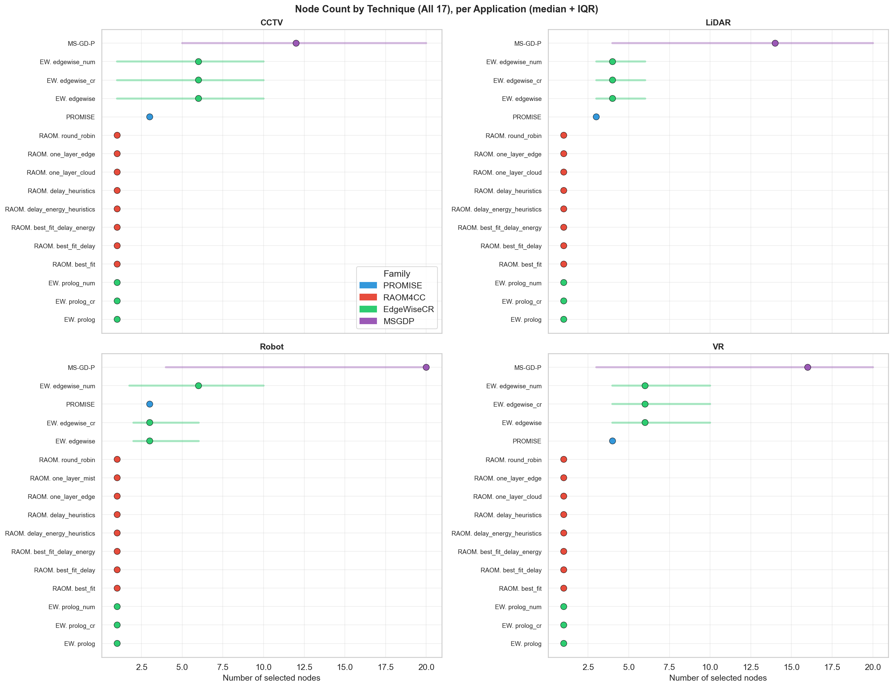

The number of nodes that each technique selects varies by application type, particularly for
PROMISE and EdgeWiseCR MILP. Table 5 reports median node counts.

**Table 5.** Median selected nodes by technique and application type (feasible
solutions only).

| Technique | CCTV | LiDAR | Robot | VR |
|:----------|:----:|:-----:|:-----:|:--:|
| PROMISE | 3 | 3 | 3 | 4 |
| RAOM4CC_one_layer_mist | 1 | 1 | 1 | 1 |
| RAOM4CC_one_layer_edge | 1 | 1 | 1 | 1 |
| RAOM4CC_one_layer_cloud | 1 | 1 | 1 | 1 |
| RAOM4CC_round_robin | 1 | 1 | 1 | 1 |
| RAOM4CC_best_fit | 1 | 1 | 1 | 1 |
| RAOM4CC_best_fit_delay | 1 | 1 | 1 | 1 |
| RAOM4CC_best_fit_delay_energy | 1 | 1 | 1 | 1 |
| RAOM4CC_delay_heuristics | 1 | 1 | 1 | 1 |
| RAOM4CC_delay_energy_heuristics | 1 | 1 | 1 | 1 |
| EdgeWiseCR_prolog | 1 | 1 | 1 | 1 |
| EdgeWiseCR_prolog_cr | 1 | 1 | 1 | 1 |
| EdgeWiseCR_prolog_num | 1 | 1 | 1 | 1 |
| EdgeWiseCR_edgewise | 6 | 4 | 3 | 6 |
| EdgeWiseCR_edgewise_cr | 6 | 4 | 3 | 6 |
| EdgeWiseCR_edgewise_num | 6 | 4 | 6 | 6 |
| MS-GD-P | 12 | 14 | 20 | 16 |

All RAOM4CC and EdgeWiseCR greedy variants select a single node regardless of workload,
because their greedy and single-layer strategies co-locate resources on the first feasible
device. EdgeWiseCR MILP selects more nodes on CCTV and VR (median 6) than on LiDAR (4) or
Robot (3–6 depending on variant), because the MILP formulation distributes demand across many small contributions
when the workload's resource profile benefits from aggregation. MS-GD-P selects 12–20 nodes
(median 16 overall), far more than any other technique, because its genetic algorithm
maximises user coverage by deploying many service instances across the topology without
regard for cost minimisation. PROMISE selects 3 nodes for
CCTV, LiDAR, and Robot, and 4 for VR, reflecting the constraint solver's balancing of cost
minimisation against feature coverage and provider exclusion constraints.

The practical trade-off is between management overhead (fewer nodes are simpler to operate)
and resource adequacy (more nodes provide better coverage and lower per-node load). PROMISE's
selection of 3–4 nodes represents a middle ground: sufficient to satisfy feature and
exclusion constraints, but compact enough to avoid excessive management complexity.

## 5. Cost Analysis

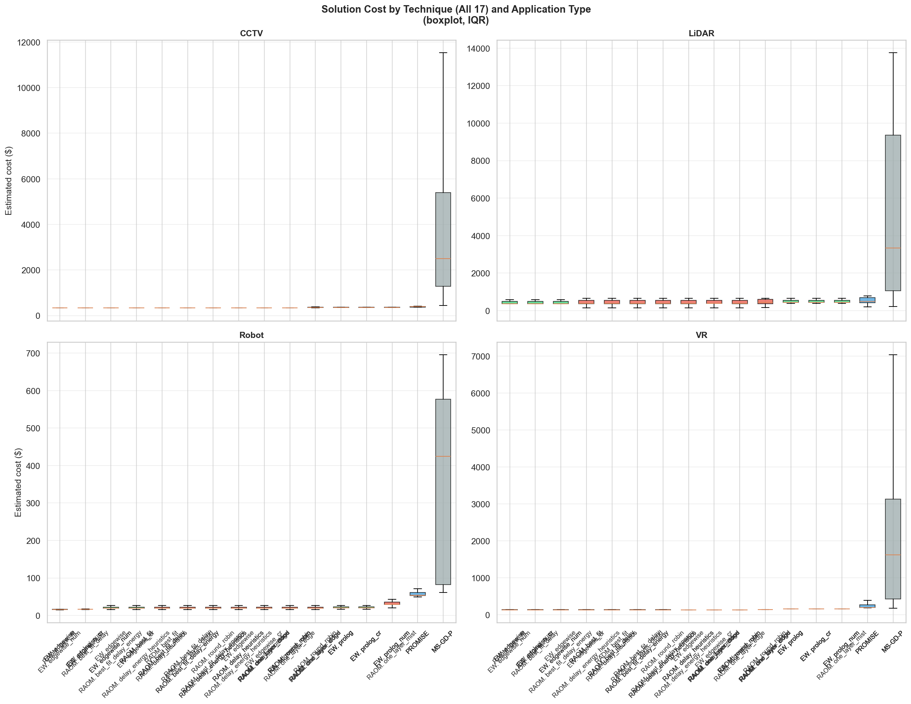

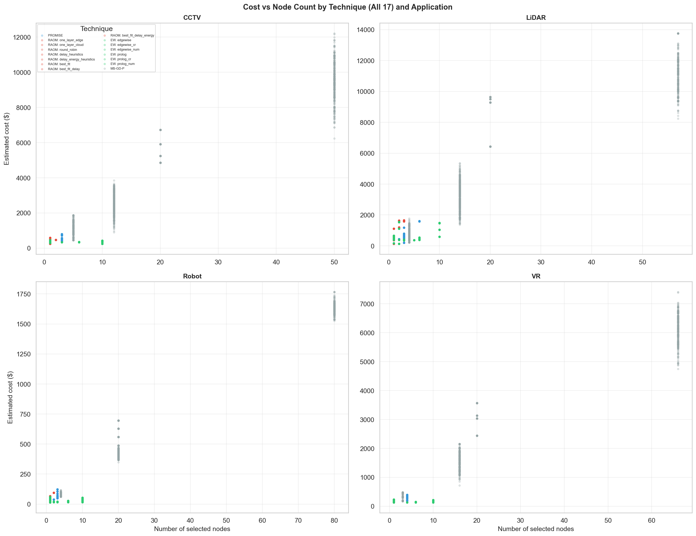

The raw cost figures reported by each technique are not directly comparable, but they
warrant analysis because they reveal the structural mechanism by which the baselines
achieve their apparent advantage. Table 6 reports the solution-cost range (min–max in $)
by technique, disaggregated by application type and infrastructure scale (S, M, L).

**Table 6.** Solution-cost range (min–max, $) by technique, application type, and
scenario scale (feasible solutions only). Each application block reports three
sub-columns, one per scale (S / M / L). The final block aggregates over all four
applications.

| Technique | CCTV (S) | CCTV (M) | CCTV (L) | LiDAR (S) | LiDAR (M) | LiDAR (L) | Robot (S) | Robot (M) | Robot (L) | VR (S) | VR (M) | VR (L) |
|:----------|:--------:|:--------:|:--------:|:---------:|:---------:|:---------:|:---------:|:---------:|:---------:|:------:|:------:|:------:|
| PROMISE | 395.19–794.18 | 372.15–408.25 | 372.15–564.42 | 206.46–585.96 | 411.65–751.27 | 411.65–1607.49 | 37.83–58.26 | 52.70–71.04 | 52.70–123.24 | 193.90–344.10 | 188.65–268.90 | 187.70–389.37 |
| RAOM4CC_one_layer_mist | 336.05–409.71 | 337.35–391.55 | 247.16–592.97 | 138.55–468.01 | 366.15–615.52 | 366.15–1626.24 | 16.02–32.80 | 18.12–65.25 | 18.90–95.50 | 135.15–165.31 | 135.15–152.82 | 135.15–221.77 |
| RAOM4CC_one_layer_edge | 336.05–409.71 | 337.35–391.55 | 247.16–592.97 | 138.55–468.01 | 366.15–615.52 | 366.15–1626.24 | 16.02–32.80 | 18.12–65.25 | 18.90–95.50 | 135.15–165.31 | 135.15–152.82 | 135.15–221.77 |
| RAOM4CC_one_layer_cloud | 336.05–409.71 | 337.35–391.55 | 247.16–592.97 | 138.55–468.01 | 366.15–615.52 | 366.15–1626.24 | 16.02–32.80 | 18.12–65.25 | 18.90–95.50 | 135.15–165.31 | 135.15–152.82 | 135.15–221.77 |
| RAOM4CC_round_robin | 336.05–352.17 | 337.35–342.95 | 247.16–423.06 | 138.55–412.95 | 366.15–579.65 | 366.15–1658.00 | 16.02–20.43 | 18.12–26.82 | 18.90–52.92 | 135.15–136.59 | 135.15–150.30 | 135.15–211.46 |
| RAOM4CC_best_fit | 336.05–352.17 | 337.35–342.95 | 247.16–423.06 | 138.55–412.95 | 366.15–579.65 | 366.15–1658.00 | 16.02–20.43 | 18.12–26.82 | 18.90–52.92 | 135.15–136.59 | 135.15–150.30 | 135.15–211.46 |
| RAOM4CC_best_fit_delay | 336.05–352.17 | 337.35–342.95 | 247.16–423.06 | 138.55–412.95 | 366.15–579.65 | 366.15–1658.00 | 16.02–20.43 | 18.12–26.82 | 18.90–52.92 | 135.15–136.59 | 135.15–150.30 | 135.15–211.46 |
| RAOM4CC_best_fit_delay_energy | 336.05–352.17 | 337.35–342.95 | 247.16–423.06 | 138.55–412.95 | 366.15–579.65 | 366.15–1658.00 | 16.02–20.43 | 18.12–26.82 | 18.90–52.92 | 135.15–136.59 | 135.15–150.30 | 135.15–211.46 |
| RAOM4CC_delay_heuristics | 336.05–352.17 | 337.35–342.95 | 247.16–423.06 | 138.55–412.95 | 366.15–579.65 | 366.15–1658.00 | 16.02–20.43 | 18.12–26.82 | 18.90–52.92 | 135.15–136.59 | 135.15–150.30 | 135.15–211.46 |
| RAOM4CC_delay_energy_heuristics | 336.05–352.17 | 337.35–342.95 | 247.16–423.06 | 138.55–412.95 | 366.15–579.65 | 366.15–1658.00 | 16.02–20.43 | 18.12–26.82 | 18.90–52.92 | 135.15–136.59 | 135.15–150.30 | 135.15–211.46 |
| EdgeWiseCR_prolog | 337.35–409.71 | 358.78–367.75 | 289.49–459.93 | 166.31–468.01 | 437.31–615.52 | 437.31–1551.64 | 15.24–20.43 | 15.80–28.83 | 16.21–59.28 | 135.15–165.31 | 155.25–170.50 | 155.25–232.37 |
| EdgeWiseCR_prolog_cr | 337.35–409.71 | 358.78–367.75 | 289.49–459.93 | 166.31–468.01 | 437.31–615.52 | 437.31–1551.64 | 15.24–20.43 | 15.80–28.83 | 16.21–59.28 | 135.15–165.31 | 155.25–170.50 | 155.25–232.37 |
| EdgeWiseCR_prolog_num | 337.35–409.71 | 358.78–367.75 | 289.49–459.93 | 166.31–468.01 | 437.31–615.52 | 437.31–1551.64 | 15.24–20.43 | 15.80–28.83 | 16.21–59.28 | 135.15–165.31 | 155.25–170.50 | 155.25–232.37 |
| EdgeWiseCR_edgewise | 336.05–339.71 | 337.35–342.95 | 247.16–423.06 | 136.31–398.01 | 366.15–545.52 | 366.15–1481.64 | 15.15–20.43 | 15.50–26.82 | 15.75–52.92 | 135.15–135.31 | 135.15–150.30 | 135.15–211.46 |
| EdgeWiseCR_edgewise_cr | 336.05–339.71 | 337.35–342.95 | 247.16–423.06 | 136.31–398.01 | 366.15–545.52 | 366.15–1481.64 | 15.15–20.43 | 15.50–26.82 | 15.75–52.92 | 135.15–135.31 | 135.15–150.30 | 135.15–211.46 |
| EdgeWiseCR_edgewise_num | 336.05–339.71 | 337.35–342.95 | 247.16–423.06 | 136.31–398.01 | 366.15–545.52 | 366.15–1481.64 | 15.15–20.43 | 15.50–26.82 | 15.75–52.92 | 135.15–135.31 | 135.15–150.30 | 135.15–211.46 |
| MS-GD-P | 451.30–1874.34 | 897.88–3848.03 | 4861.58–12202.80 | 217.99–1763.33 | 1361.31–5350.88 | 6429.50–13750.43 | 61.00–117.17 | 348.03–487.26 | 466.32–1765.92 | 172.75–485.87 | 721.11–2152.12 | 2441.42–7407.65 |

**Table 6a.** Global solution-cost range (min–max, $) aggregated over all four
applications, by technique and scenario scale.

| Technique | S (all apps) | M (all apps) | L (all apps) |
|:----------|:------------:|:------------:|:------------:|
| PROMISE | 37.83–794.18 | 52.70–751.27 | 52.70–1607.49 |
| RAOM4CC_one_layer_mist | 16.02–468.01 | 18.12–615.52 | 18.90–1626.24 |
| RAOM4CC_one_layer_edge | 16.02–468.01 | 18.12–615.52 | 18.90–1626.24 |
| RAOM4CC_one_layer_cloud | 16.02–468.01 | 18.12–615.52 | 18.90–1626.24 |
| RAOM4CC_round_robin | 16.02–412.95 | 18.12–579.65 | 18.90–1658.00 |
| RAOM4CC_best_fit | 16.02–412.95 | 18.12–579.65 | 18.90–1658.00 |
| RAOM4CC_best_fit_delay | 16.02–412.95 | 18.12–579.65 | 18.90–1658.00 |
| RAOM4CC_best_fit_delay_energy | 16.02–412.95 | 18.12–579.65 | 18.90–1658.00 |
| RAOM4CC_delay_heuristics | 16.02–412.95 | 18.12–579.65 | 18.90–1658.00 |
| RAOM4CC_delay_energy_heuristics | 16.02–412.95 | 18.12–579.65 | 18.90–1658.00 |
| EdgeWiseCR_prolog | 15.24–468.01 | 15.80–615.52 | 16.21–1551.64 |
| EdgeWiseCR_prolog_cr | 15.24–468.01 | 15.80–615.52 | 16.21–1551.64 |
| EdgeWiseCR_prolog_num | 15.24–468.01 | 15.80–615.52 | 16.21–1551.64 |
| EdgeWiseCR_edgewise | 15.15–398.01 | 15.50–545.52 | 15.75–1481.64 |
| EdgeWiseCR_edgewise_cr | 15.15–398.01 | 15.50–545.52 | 15.75–1481.64 |
| EdgeWiseCR_edgewise_num | 15.15–398.01 | 15.50–545.52 | 15.75–1481.64 |
| MS-GD-P | 61.00–1874.34 | 348.03–5350.88 | 466.32–13750.43 |

The range disaggregation confirms three regularities. First, every technique's cost range
widens from S to L—the two applications with the highest user counts see the steepest
widening because larger user populations raise demand and admit richer (and pricier)
infrastructures. MS-GD-P shows the most dramatic scaling: its LiDAR costs rise from
$217.99–$1 763.33 (S) to $6 429.50–$13 750.43 (L), and CCTV from $451.30–$1 874.34 (S) to
$4 861.58–$12 202.80 (L), because it selects up to 80 nodes at large scale and the
fixed-charge model bills each one. PROMISE's LiDAR maximum rises from $585.96 (S) to
$1 607.49 (L), a 2.7× increase, and EdgeWiseCR greedy nearly doubles from $468.01 to
$1 551.64. Second, CCTV and Robot ranges are comparatively scale-invariant for the
single-node baselines: CCTV maximums stay within $340–$460 and Robot remains under $60,
except for MS-GD-P which reaches $12 202.80 (CCTV L) and $1 765.92 (Robot L). Third, the
single-node baselines' lower bound is consistently below PROMISE's, while MS-GD-P's upper
bound consistently exceeds PROMISE's—by up to 24× on CCTV (L) and 8.5× on LiDAR (L).
PROMISE occupies the middle of the cost distribution: more expensive than the single-node
baselines (which under-count constraints) but far cheaper than MS-GD-P (which over-provisions
nodes). The global table confirms that MS-GD-P occupies the extreme high-cost tail at every
scale band ($13 750.43 at L vs. PROMISE's $1 607.49), reflecting the cost penalty of
deploying many more nodes than the workload requires.

### 5.1 Why the Costs Are Not Comparable

Three structural factors inflate PROMISE's reported cost relative to the baselines, and none
of them reflects inefficiency on PROMISE's part.

**Factor 1: Constraint coverage.** PROMISE enforces 12 hard constraint types; the baselines
enforce 6. The six constraints that only PROMISE enforces—provider exclusions, inclusion
groups, the feature type system, subscription min/max, renewable/non-renewable resource
tracking, and distance constraints—eliminate the cheapest solutions that the baselines can
select. A baseline solution that places two incompatible providers on the same node
reports a low cost because it ignores the exclusion; PROMISE must either select a different
provider or add a second node to satisfy the exclusion, increasing the reported cost. The
cost difference is the price of deployability.

**Factor 2: Node count.** The single-node baselines (all RAOM4CC variants, EdgeWiseCR
`prolog`) select exactly one node on every feasible scenario. A single-node solution
concentrates all demand on one device and reports only that device's price. PROMISE
selects 3–4 nodes to satisfy feature and exclusion constraints, and its reported cost
is the sum of all selected nodes' prices. MS-GD-P selects 12–80 nodes (median 16),
inflating its reported cost far above PROMISE because the fixed-charge model bills every
selected node for its resource contribution. The cost comparison therefore confounds
constraint satisfaction with infrastructure quantity: the single-node baselines report
the cost of one device, PROMISE reports the cost of a deployable deployment, and MS-GD-P
reports the cost of a heavily over-provisioned deployment.

**Factor 3: Pricing formalism.** PROMISE uses symbolic price expressions from the iPricing
model, which account for subscription minimums, usage limits, and renewable/non-renewable
resource tiers. The baselines use a simplified cost model that sums per-unit resource
prices without subscription or tier awareness. A provider that offers a volume discount
above a subscription minimum appears cheaper in the baseline model than in PROMISE's model,
because the baseline does not model the minimum quantity constraint that triggers the
discount.

### 5.2 PROMISE vs Single-Node Baselines: Deployability Trumps Nominal Cost

Despite reporting higher nominal costs, PROMISE produces structurally superior solutions to
the single-node baselines on every application type. The superiority is not a matter of
cost efficiency but of solution adequacy.

A single-node solution cannot, in general, satisfy the constraint set that production
deployments impose. Provider exclusion constraints require that selected add-ons do not
co-locate incompatible providers; when a workload's feature requirements span two
providers that exclude each other, no single node can satisfy the request. Feature type
constraints require that selected nodes cover the full feature set (DOMAIN, INTEGRATION,
AUTOMATION, etc.); a single node rarely provides all required feature types. Subscription
minimum constraints require that certain providers be selected with a minimum quantity
(e.g., two nodes from the same provider); a single-node selection violates this constraint
by construction.

The cost scatter plots in Figure (cost vs node count) make this structural limitation
visible. The single-node baselines cluster at node count = 1 with low cost, while PROMISE
occupies the 3–4 node range at higher cost. The gap between these clusters is the cost of
satisfying the six constraints that the baselines ignore. A deployment that uses a
single-node baseline solution would require manual post-hoc validation against every
constraint the baseline skipped, and would need to add nodes (and cost) to fix violations.
PROMISE's reported cost already includes this constraint satisfaction; the baselines' does
not.

EdgeWiseCR MILP occupies an intermediate position: it selects 3–6 nodes and reports costs
close to the single-node baselines, because its MILP formulation minimises cost over the
simplified constraint set. Its solutions are more richly structured than single-node
baselines but still violate the six constraints it does not model. It is the strongest
baseline on raw cost, but its cost advantage disappears when the missing constraints are
enforced. MS-GD-P sits at the opposite extreme: by selecting 12–80 nodes without cost
optimimisation, it reports the highest costs of any technique—up to $13 750.43 on LiDAR
(L), 8.5× more than PROMISE on the same scenarios. Its genetic algorithm maximises user
coverage rather than minimising deployment cost, illustrating that coverage-driven
placement without price awareness leads to severe over-provisioning.

### 5.3 Conclusion on Cost Comparability

We conclude that the cost figures across techniques are not comparable. The single-node
baselines report lower costs because they solve a relaxed problem: they ignore six hard
constraint types, select one node, and use a simplified pricing model. MS-GD-P reports the
highest costs because it over-provisions nodes without price optimisation. PROMISE solves
the full problem, selects 3–4 nodes, and reports the cost of a deployable solution that is
both constraint-complete and cost-aware. The apparent cost advantage of the single-node
baselines is an artefact of constraint relaxation; the cost penalty of MS-GD-P is an
artefact of coverage maximisation without cost awareness. PROMISE's intermediate cost
position reflects the true cost of a production-ready deployment.

## 6. Synthesis by Application Type

Table 7 synthesises the per-application results into a compact comparison. For each
application, we report PROMISE's large-scale behaviour, the feasibility failures observed in
single-layer baselines, the node selection profile, and the technique recommendation
appropriate to that workload.

**Table 7.** Synthesis of results by application type.

| | CCTV | LiDAR | Robot | VR |
|:---|:-----|:------|:------|:---|
| **PROMISE time (large, median)** | 1.15 s | 0.34 s | 2.88 s | 5.65 s |
| **PROMISE time (max observed)** | 8.88 s | 0.67 s | 43.80 s | 83.78 s |
| **PROMISE cost (median $)** | 396.67 | 493.91 | 53.62 | 198.70 |
| **Cheapest baseline cost ($)** | 337.35 | 367.31 | 18.87 | 135.15 |
| **PROMISE nodes (median)** | 3 | 3 | 3 | 4 |
| **MS-GD-P nodes (median)** | 12 | 14 | 20 | 16 |
| **Baseline feasibility failure** | RAOM4CC_one_layer_mist (0 %) | RAOM4CC_one_layer_mist (0 %), RAOM4CC_one_layer_cloud (91.7 %) | RAOM4CC_one_layer_cloud (0 %), RAOM4CC_one_layer_mist (83.3 %) | RAOM4CC_one_layer_mist (0 %) |
| **EW MILP nodes (median)** | 6 | 4 | 3 | 6 |
| **PROMISE/baseline speed gap** | 1 072× | 949× | 1 045× | 1 201× |
| **Scalability profile** | Moderate | Excellent | Steep after 300 nodes | Steepest after 200 nodes |
| **Recommended for offline planning** | PROMISE | PROMISE | PROMISE (≤300 nodes) | PROMISE (≤200 nodes) |
| **Recommended for real-time** | RAOM4CC advanced | RAOM4CC advanced | RAOM4CC advanced (edge tier) | RAOM4CC advanced |

LiDAR is the workload where PROMISE's trade-off is most favourable: the solver completes in
under 0.7 s even at maximum scale, making the constraint coverage advantage affordable. VR
is the workload where the trade-off is most strained: at 500 nodes, PROMISE's 83.8 s maximum
exceeds the threshold for interactive planning, though it remains acceptable for batch
optimisation. Robot and CCTV occupy intermediate positions, with Robot requiring particular
care above 300 nodes.

## 7. PROMISE's Structural Advantages

### 7.1 Established Pricing Formalism

PROMISE uses the iPricing model (Protocol Buffers schema), a formalism for SaaS pricing in the
computing continuum. The model represents infrastructure as add-ons with symbolic price
expressions, usage limits, features, and exclusion/inclusion relations. This formalism is
reusable across cloud, edge, and mist scenarios without modification.

### 7.2 Provider Interoperability Constraints

PROMISE models `excludes` and `compatible_provider_groups` relations between add-ons. Each
topology in the benchmark contains 20–30 exclusion relations (e.g., OPTUS devices exclude
TELSTRA devices from co-deployment). The solver enforces these relations as hard
constraints. None of the baselines model provider exclusions; a baseline solution may select
incompatible providers together, making it non-deployable.

### 7.3 Feature and Domain Constraints

PROMISE models features with a typed system (`FeatureType`: DOMAIN, INTEGRATION, AUTOMATION,
MANAGEMENT, GUARANTEE, SUPPORT, PAYMENT). Features are boolean requirements that selected
nodes must satisfy. The baselines do not model features.

### 7.4 Subscription and Quantity Constraints

PROMISE models `SubscriptionConstraints` per add-on: `minQuantity`, `maxQuantity`, and
`quantityStep`. This enables realistic provisioning constraints (e.g., a provider requires a
minimum of 2 nodes to be selected together).

### 7.5 Full Solution Space Exploration

PROMISE uses a constraint programming solver (MiniZinc) that explores the full feasible
solution space without heuristic pruning. The baselines use various strategies to reduce the
search space:

| Technique | Search strategy | Optimality guarantee |
|:----------|:----------------|:---------------------|
| PROMISE | Full constraint satisfaction | Optimal (CP solver) |
| RAOM4CC_one_layer_mist | Single-tier greedy first-fit | None |
| RAOM4CC_one_layer_edge | Single-tier greedy first-fit | None |
| RAOM4CC_one_layer_cloud | Single-tier greedy first-fit | None |
| RAOM4CC_round_robin | Heuristic ordering + greedy selection | None |
| RAOM4CC_best_fit | Heuristic ordering + greedy selection | None |
| RAOM4CC_best_fit_delay | Heuristic ordering + greedy selection | None |
| RAOM4CC_best_fit_delay_energy | Heuristic ordering + greedy selection | None |
| RAOM4CC_delay_heuristics | Heuristic ordering + greedy selection | None |
| RAOM4CC_delay_energy_heuristics | Heuristic ordering + greedy selection | None |
| EdgeWiseCR_prolog | Bin-packing heuristic | None |
| EdgeWiseCR_prolog_cr | Bin-packing heuristic | None |
| EdgeWiseCR_prolog_num | Bin-packing heuristic | None |
| EdgeWiseCR_edgewise | Simplified MILP formulation | Optimal of simplified model |
| EdgeWiseCR_edgewise_cr | Simplified MILP formulation | Optimal of simplified model |
| EdgeWiseCR_edgewise_num | Simplified MILP formulation | Optimal of simplified model |
| MS-GD-P | Genetic algorithm (priority-based) | None |

## 8. Strengths and Weaknesses by Technique

### PROMISE

| Strengths | Weaknesses |
|:----------|:-----------|
| Full constraint coverage (12/12 types) | Solver time up to 83.8 s (VR, large scale) |
| 100 % feasibility on all applications | Requires Docker infrastructure |
| Optimal solution with certificate | Not suitable for real-time VR/Robot at large scale |
| Provider exclusion/inclusion enforcement | REST API adds ~1.4 % overhead |
| Application-adaptive node selection (3–4 nodes) | |

### RAOM4CC_one_layer_mist

| Strengths | Weaknesses |
|:----------|:-----------|
| Fastest execution (< 0.1 ms) | 0 % feasibility for CCTV, LiDAR, VR |
| Minimal implementation | Only 83.3 % feasibility for Robot |
| | Only 6/12 hard constraints |
| | Solutions may not be deployable |

### RAOM4CC_one_layer_edge

| Strengths | Weaknesses |
|:----------|:-----------|
| Fastest execution (< 0.1 ms) | 87.5 % feasibility for LiDAR |
| 100 % feasibility for CCTV, Robot, VR | Only 6/12 hard constraints |
| Universally feasible single-tier variant | Solutions may not be deployable |
| Minimal implementation | |

### RAOM4CC_one_layer_cloud

| Strengths | Weaknesses |
|:----------|:-----------|
| Fastest execution (< 0.1 ms) | 0 % feasibility for Robot |
| 100 % feasibility for CCTV, VR | 91.7 % feasibility for LiDAR |
| | Only 6/12 hard constraints |
| | Solutions may not be deployable |

### RAOM4CC_round_robin

| Strengths | Weaknesses |
|:----------|:-----------|
| Sub-millisecond execution (0.2–0.6 ms) | Only 6/12 hard constraints |
| 100 % feasibility on all applications | Ignores provider exclusions |
| No external solver dependency | No optimality guarantee |
| | Solutions may not be deployable |

### RAOM4CC_best_fit

| Strengths | Weaknesses |
|:----------|:-----------|
| Sub-millisecond execution (0.2–0.6 ms) | Only 6/12 hard constraints |
| 100 % feasibility on all applications | Ignores provider exclusions |
| No external solver dependency | No optimality guarantee |
| | Solutions may not be deployable |

### RAOM4CC_best_fit_delay

| Strengths | Weaknesses |
|:----------|:-----------|
| Sub-millisecond execution (0.2–0.6 ms) | Only 6/12 hard constraints |
| 100 % feasibility on all applications | Ignores provider exclusions |
| No external solver dependency | No optimality guarantee |
| | Solutions may not be deployable |

### RAOM4CC_best_fit_delay_energy

| Strengths | Weaknesses |
|:----------|:-----------|
| Sub-millisecond execution (0.2–0.6 ms) | Only 6/12 hard constraints |
| 100 % feasibility on all applications | Ignores provider exclusions |
| No external solver dependency | No optimality guarantee |
| | Solutions may not be deployable |

### RAOM4CC_delay_heuristics

| Strengths | Weaknesses |
|:----------|:-----------|
| Sub-millisecond execution (0.2–0.6 ms) | Only 6/12 hard constraints |
| 100 % feasibility on all applications | Ignores provider exclusions |
| No external solver dependency | No optimality guarantee |
| | Solutions may not be deployable |

### RAOM4CC_delay_energy_heuristics

| Strengths | Weaknesses |
|:----------|:-----------|
| Sub-millisecond execution (0.2–0.6 ms) | Only 6/12 hard constraints |
| 100 % feasibility on all applications | Ignores provider exclusions |
| No external solver dependency | No optimality guarantee |
| | Solutions may not be deployable |

### EdgeWiseCR_prolog

| Strengths | Weaknesses |
|:----------|:-----------|
| Sub-millisecond execution (0.6 ms median) | Only 6/12 hard constraints |
| 100 % feasibility on all applications | Ignores provider exclusions |
| Simple greedy logic | Always selects 1 node (limited coverage) |
| | No optimality guarantee |

### EdgeWiseCR_prolog_cr

| Strengths | Weaknesses |
|:----------|:-----------|
| Sub-millisecond execution (0.6 ms median) | Only 6/12 hard constraints |
| 100 % feasibility on all applications | Ignores provider exclusions |
| Simple greedy logic | Always selects 1 node (limited coverage) |
| | No optimality guarantee |

### EdgeWiseCR_prolog_num

| Strengths | Weaknesses |
|:----------|:-----------|
| Sub-millisecond execution (0.6 ms median) | Only 6/12 hard constraints |
| 100 % feasibility on all applications | Ignores provider exclusions |
| Simple greedy logic | Always selects 1 node (limited coverage) |
| | No optimality guarantee |

### EdgeWiseCR_edgewise

| Strengths | Weaknesses |
|:----------|:-----------|
| Millisecond execution (2–3 ms median) | Only 6/12 hard constraints |
| 100 % feasibility on all applications | Ignores provider exclusions |
| Optimal of simplified model | Selects 3–6 nodes (higher management overhead) |
| Execution time app-agnostic | Solutions may not be deployable |

### EdgeWiseCR_edgewise_cr

| Strengths | Weaknesses |
|:----------|:-----------|
| Millisecond execution (2–3 ms median) | Only 6/12 hard constraints |
| 100 % feasibility on all applications | Ignores provider exclusions |
| Optimal of simplified model | Selects 3–6 nodes (higher management overhead) |
| Execution time app-agnostic | Solutions may not be deployable |

### EdgeWiseCR_edgewise_num

| Strengths | Weaknesses |
|:----------|:-----------|
| Millisecond execution (2–3 ms median) | Only 6/12 hard constraints |
| 100 % feasibility on all applications | Ignores provider exclusions |
| Optimal of simplified model | Selects 3–6 nodes (higher management overhead) |
| Execution time app-agnostic | Solutions may not be deployable |

### MS-GD-P

| Strengths | Weaknesses |
|:----------|:-----------|
| Millisecond execution (4–11 ms) | Only 6/12 hard constraints |
| 11.8 % feasibility under provider exclusion | Ignores provider exclusions |
| Multi-node selection (~21 nodes avg) | No optimality guarantee |
| Genetic algorithm explores diverse solutions | Highest cost of all techniques (over-provisioning) |

## 9. No Absolute Winner

No single technique dominates across all dimensions and all application types. The
appropriate choice depends on the deployment context, the application workload, and the
infrastructure scale.

| Context | Recommended technique | Rationale |
|:--------|:----------------------|:----------|
| Full constraint enforcement, any app | PROMISE | Only technique with 12/12 coverage |
| Offline planning, LiDAR | PROMISE | Solver time < 0.7 s even at max scale |
| Offline planning, CCTV (≤300 nodes) | PROMISE | Solver time < 1 s, full coverage |
| Offline planning, Robot (≤300 nodes) | PROMISE | Solver time < 1.7 s, full coverage |
| Offline planning, VR (≤200 nodes) | PROMISE | Solver time < 1 s, full coverage |
| Real-time, any app, basic constraints | RAOM4CC advanced | Sub-ms execution, 100 % feasibility |
| Multi-node placement, fast execution | MS-GD-P | 4–11 ms execution, 11.8 % feasibility under exclusion, ~21 nodes |
| Large-scale, simplified constraints | EdgeWiseCR MILP | 2–3 ms execution, optimal of simplified model |
| Single-tier requirement | RAOM4CC_one_layer_edge | Only single-tier variant with 100 % feasibility on all apps |

## 10. Recommendations

1. **For production use with real providers:** Use PROMISE. Provider exclusion and feature
   constraints are essential for deployable solutions, and no baseline enforces them.

2. **For LiDAR workloads at any scale:** Use PROMISE. The solver completes in under 0.7 s
   even at maximum infrastructure size, making the constraint coverage advantage affordable.

3. **For VR or Robot at large scale (>300 nodes):** Use PROMISE for offline batch
   optimisation, but consider RAOM4CC advanced heuristics for time-critical re-optimisation.
   Validate heuristic solutions manually against provider exclusions before deployment.

4. **For benchmarking with simplified constraints:** Use EdgeWiseCR MILP as the baseline.
   It provides millisecond execution, 100 % feasibility, and optimality within the simplified
   constraint model.

5. **For real-time re-optimisation on any workload:** Use RAOM4CC advanced heuristics with
   feasibility-aware placement. The sub-millisecond execution enables dynamic
   re-optimisation, but solutions require manual validation against provider exclusions and
   feature requirements.

6. **For single-tier deployment constraints:** Use RAOM4CC_one_layer_edge. It is the only
   single-layer variant that achieves 100 % feasibility across all four application types.
   Avoid RAOM4CC_one_layer_mist for CCTV, LiDAR, and VR; avoid RAOM4CC_one_layer_cloud for
   Robot.

7. **For multi-node placement with fast execution:** Use MS-GD-P with caution. It provides
   4–11 ms execution and selects 12–80 nodes (median 16)—far more than PROMISE's 3–4 node
   solutions—at 11.8 % feasibility under provider exclusion (2.1 % under full device-type
   coverage). Its cost is the highest of all techniques due to over-provisioning. Solutions
   require manual validation against provider exclusions before deployment.

8. **For future work:** Investigate hybrid approaches that combine the speed of heuristic
   baselines with the constraint completeness of PROMISE. Constraint propagation and
   decomposition techniques could reduce PROMISE's solver time on VR and Robot at large scale
   while maintaining full constraint coverage. Application-aware solver configuration—where
   the CP model is simplified for LiDAR (compact topologies) and fully expanded for VR
   (complex constraints)—could yield per-application speedups without sacrificing
   deployability.