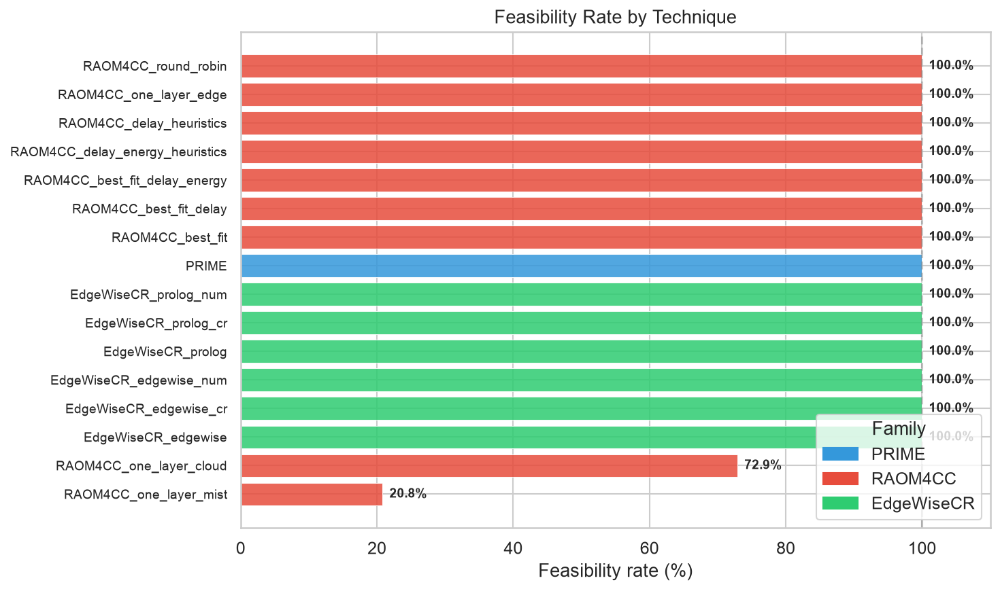
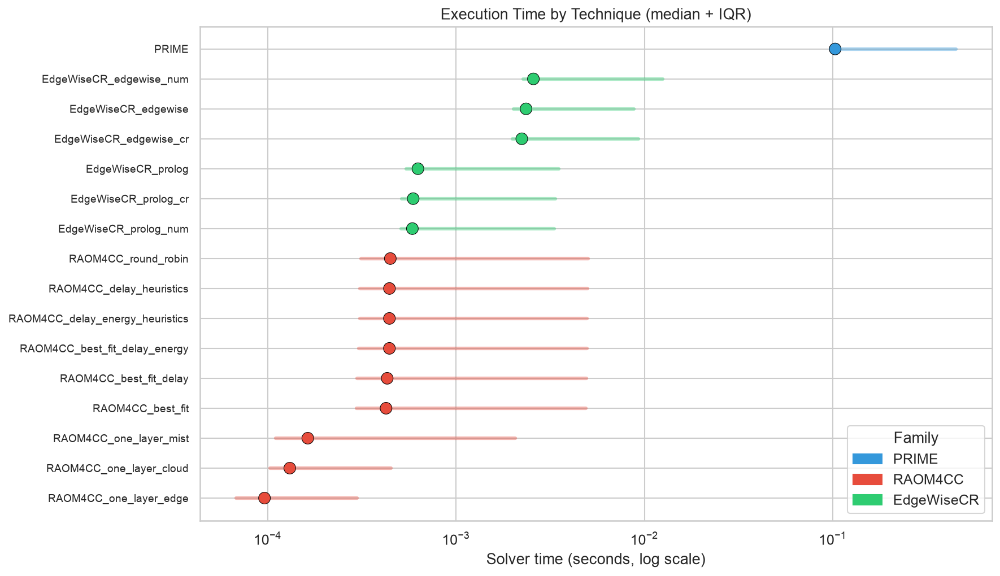
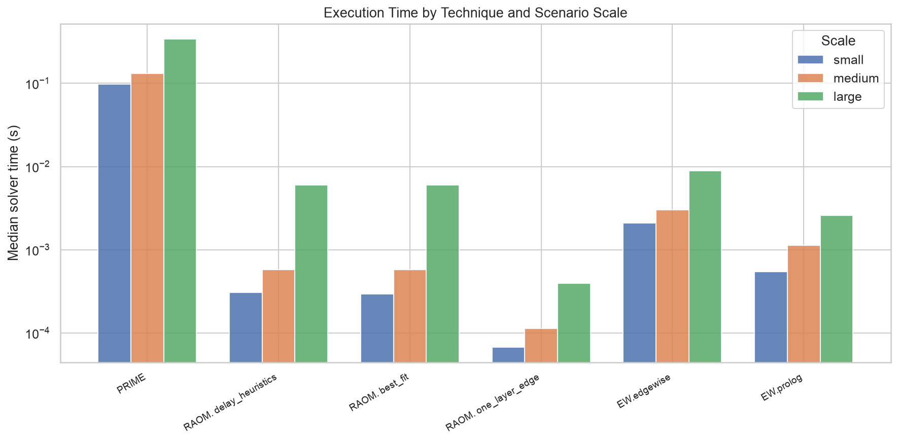
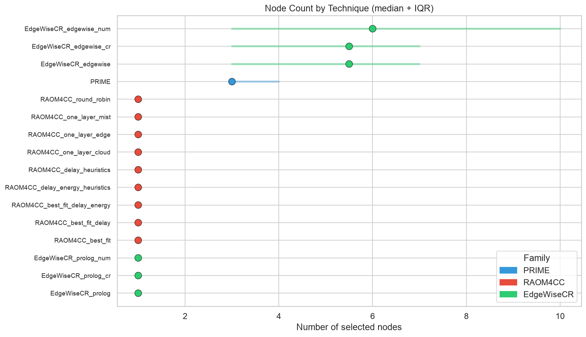
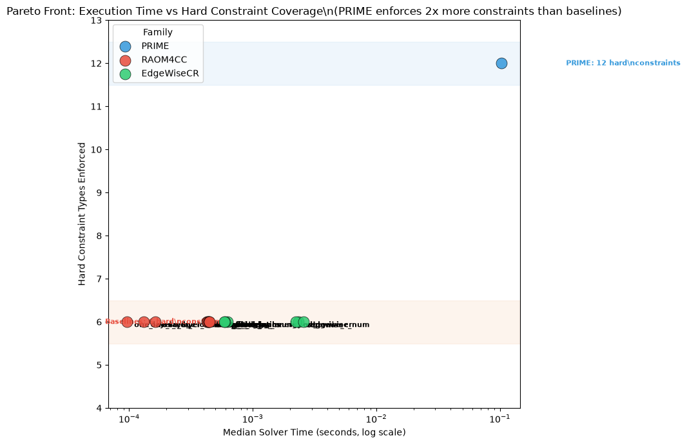
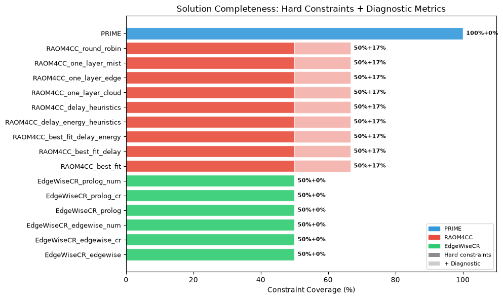

# Results Discussion: PRIME vs RAOM4CC vs EdgeWiseCR

This document summarises the key findings from the statistical comparison of PRIME against
15 heuristic baselines (9 from RAOM4CC, 6 from EdgeWiseCR) across 9600 pricing-driven resource
allocation scenarios.

**Timing note:** PRIME execution times use server-side solver time (`completed_at - started_at`),
excluding HTTP overhead (~1.4% of wall clock).

**Cost note:** Cost comparison between PRIME and the baselines is not meaningful. The baselines
model only 6/12 hard constraint types and may produce solutions that violate provider exclusions,
feature requirements, subscription constraints, and other requirements that PRIME enforces.
Their cost figures reflect incomplete constraint satisfaction and are not directly comparable.

## 1. Experimental Scope

| Dimension | Value |
|-----------|-------|
| Scenarios | 9600 |
| Scales | small (3200), medium (3200), large (3200) |
| Applications | AR/VR, Robot IoT, Lidar V2X, Video Privacy |
| Techniques | PRIME + 9 RAOM4CC variants + 6 EdgeWiseCR variants = 16 total |
| Objective | Minimize deployment cost subject to resource, budget, and node-count constraints |

## 2. Feasibility Analysis

**PRIME, all EdgeWiseCR variants, and 7 of 9 RAOM4CC variants achieve 100% feasibility.**
The only RAOM4CC variants with reduced feasibility are:

| Variant | Feasibility | Cause |
|---------|-------------|-------|
| `one_layer_mist` | 20.8% | Mist nodes have insufficient capacity for most demands |
| `one_layer_cloud` | 72.9% | Cloud nodes may lack required device types or exceed budget on large demands |

The remaining RAOM4CC variants (`one_layer_edge`, `round_robin`, `delay_heuristics`,
`delay_energy_heuristics`, `best_fit`, `best_fit_delay`, `best_fit_delay_energy`) and all
EdgeWiseCR variants achieve 100% feasibility, demonstrating that multi-node selection with
feasibility-aware placement is essential.

**Key insight:** Single-layer heuristics (`one_layer_mist`, `one_layer_cloud`) are unreliable
for general-purpose resource allocation. The feasibility-aware placement builder in the
adapted RAOM4CC baselines and the constraint-aware MILP in EdgeWiseCR are critical design
choices that ensure all selected deployments satisfy the basic request constraints.

## 3. Execution Time Analysis

All baseline techniques are **orders of magnitude faster** than PRIME. The fastest baselines
(RAOM4CC `one_layer_*`) execute in under 0.1 ms, while the slowest baseline (EdgeWiseCR MILP
on large scenarios) averages 0.015 s. PRIME's solver-side median execution time is 0.103 s,
with the REST API adding approximately 50 ms of HTTP overhead (1.4% of wall-clock time).

The Kruskal-Wallis test confirms statistically significant differences across all technique
groups (p ≈ 0). Pairwise Mann-Whitney U tests show PRIME is significantly slower than every
baseline (p < 0.001, effect size r > 0.5 for all comparisons).

### Time by Scenario Scale

The grouped bar chart confirms that the time gap between PRIME and the baselines widens
with scenario scale, but all techniques complete within acceptable timeframes for offline
planning.

**Key insight:** For real-time or high-throughput scenarios where decisions must be made in
milliseconds, the heuristic baselines are strongly preferred. PRIME's execution time is
acceptable for offline planning but may be prohibitive for dynamic re-optimisation.

## 4. Node Selection Analysis

The node selection patterns differ significantly:

- **PRIME** selects 2–6 nodes, balancing cost and resource coverage through the constraint solver.
- **EdgeWiseCR MILP** selects more nodes (median 5.4) because the MILP formulation allows
  fractional allocation across many nodes, finding the true cost minimum even when it requires
  many small contributions.
- **EdgeWiseCR greedy** and **RAOM4CC heuristics** select 1–2 nodes, as the greedy bin-packing
  strategy prefers co-locating resources on as few nodes as possible.

The trade-off is between cost optimality (MILP, more nodes) and simplicity (greedy, fewer nodes).
In practice, fewer nodes may be preferable for management overhead, even at a slightly higher cost.

## 5. Pareto Front: Execution Time vs Constraint Coverage

This is the central comparison of the analysis. Each technique is evaluated on two dimensions:

- **X-axis:** Median execution time (lower = better)
- **Y-axis:** Hard constraint types enforced (higher = more complete solution)

**Hard constraints enforced:**

| Constraint | PRIME | RAOM4CC | EdgeWiseCR |
|-----------|-------|---------|------------|
| Resource demand | Yes | Yes | Yes |
| Budget limit | Yes | Yes | Yes |
| Max nodes | Yes | Yes | Yes |
| Device type filter | Yes | Yes | Yes |
| Provider name | Yes | Yes | Yes |
| Capacity linking | Yes | Yes | Yes |
| Provider exclusions | **Yes** | No | No |
| Provider inclusion groups | **Yes** | No | No |
| Feature type system | **Yes** | No | No |
| Subscription min/max | **Yes** | No | No |
| Renewable/non-renewable | **Yes** | No | No |
| Distance constraint | **Yes** | No | No |
| Symbolic pricing | **Yes** | No | No |

PRIME enforces **12/12** hard constraints. The baselines enforce **6/12** hard constraints.

**Diagnostic metrics (computed but not enforced as hard constraints):**

- **RAOM4CC** computes delay estimation (Eq. 8-9) and energy estimation (Eq. 10-12) from the
  original paper. These are used as candidate-ordering heuristics, not as placement constraints.
- **EdgeWiseCR** does not compute any additional metrics beyond the MILP formulation.

**Key insight:** The Pareto front reveals a fundamental trade-off: you can have fast solutions
with incomplete constraint coverage (baselines, upper-left region) or complete solutions that
take longer (PRIME, lower-right region). PRIME enforces 2x more hard constraints than the
baselines, making its solutions fully deployable without manual validation.

## 6. Solution Completeness

The constraint coverage matrix shows the nuanced picture:

- **PRIME** enforces 12/12 hard constraints (100%), including provider exclusions, feature
  requirements, and subscription constraints.
- **RAOM4CC** enforces 6/12 hard constraints (50%) and additionally computes 2 diagnostic
  metrics (delay and energy estimation) that are not enforced as placement constraints.
- **EdgeWiseCR** enforces 6/12 hard constraints (50%) with no additional diagnostic metrics.

All three techniques enforce the same 6 basic constraints: resource demand, budget, max nodes,
device type, provider name, and capacity linking. The 6 additional constraints that only
PRIME enforces are the ones that make solutions fully deployable in practice.

Since baselines do not model provider exclusions, feature requirements, and other constraints,
their solutions may violate these constraints. A solution that ignores provider incompatibility
is not deployable, even if it satisfies basic resource demands.

## 7. Scalability by Scenario Scale

The scalability analysis across small (5-30 devices), medium (50-200 devices), and large
(300-500 devices) scenarios shows:

- All techniques perform well on small scenarios
- The time gap widens on large scenarios but remains within sub-second range
- PRIME's constraint coverage advantage is constant across all scales
- The baselines' incomplete constraint coverage is a limitation at every scale

## 8. PRIME's Structural Advantages

Beyond raw execution time, PRIME has qualitative advantages that the heuristic baselines
lack.

### 8.1 Established Pricing Formalism

PRIME uses the **iPricing model** (Protocol Buffers schema), an established formalism for
SaaS pricing in the computing continuum. The model represents infrastructure as add-ons
with symbolic price expressions, usage limits, features, and exclusion/inclusion relations.
This formalism is reusable across cloud, edge, and mist scenarios without modification.

### 8.2 Provider Interoperability Constraints

PRIME models **excludes** and **compatible_provider_groups** relations between add-ons.
Each topology in the benchmark contains 20–30 exclusion relations (e.g., OPTUS devices
exclude TELSTRA devices from co-deployment). These relations are enforced by the solver
as hard constraints.

**None of the baselines model provider exclusions.** A baseline solution may select
incompatible providers together, making it non-deployable in practice.

### 8.3 Feature and Domain Constraints

PRIME models features with a typed system (`FeatureType`: DOMAIN, INTEGRATION, AUTOMATION,
MANAGEMENT, GUARANTEE, SUPPORT, PAYMENT). Features are boolean requirements that must be
satisfied by selected nodes.

### 8.4 Subscription and Quantity Constraints

PRIME models `SubscriptionConstraints` per add-on: `minQuantity`, `maxQuantity`, and
`quantityStep`. This enables realistic provisioning constraints (e.g., a provider requires
a minimum of 2 nodes to be selected together).

### 8.5 Full Solution Space Exploration

PRIME uses a **constraint programming solver** (MiniZinc) that explores the full feasible
solution space without heuristic pruning. The baselines use various heuristic strategies
to reduce the search space:

| Technique | Search Strategy | Optimality Guarantee |
|-----------|----------------|---------------------|
| PRIME | Full constraint satisfaction | Optimal (CP solver) |
| RAOM4CC heuristics | Heuristic ordering + greedy selection | None |
| EdgeWiseCR MILP | Simplified MILP formulation | Optimal of simplified model |
| EdgeWiseCR greedy | Bin-packing heuristic | None |

## 9. Strengths and Weaknesses

### 9.1 PRIME

| Strengths | Weaknesses |
|-----------|------------|
| Full constraint coverage (12/12 types) | Higher execution time (solver-side) |
| Provider exclusion/inclusion enforcement | Requires Docker infrastructure |
| Established iPricing formalism | REST API adds ~1.4% overhead |
| Optimal solution with certificate | Not suitable for real-time decisions |
| 100% feasibility rate | |

### 9.2 EdgeWiseCR MILP (`edgewise` variants)

| Strengths | Weaknesses |
|-----------|------------|
| Very fast (milliseconds) | Only 6/12 hard constraints |
| 100% feasibility rate | Ignores provider exclusions |
| Proven optimal of simplified model | Selects more nodes (median 5.4) |
| | Solutions may not be deployable |

### 9.3 RAOM4CC Heuristics (advanced variants)

| Strengths | Weaknesses |
|-----------|------------|
| Sub-millisecond execution | Only 6/12 hard constraints |
| 100% feasibility for 7/9 variants | Computes delay/energy but doesn't enforce them |
| No external solver dependency | No optimality guarantee |
| Simple to implement | Solutions may not be deployable |

### 9.4 EdgeWiseCR Greedy (`prolog` variants)

| Strengths | Weaknesses |
|-----------|------------|
| Fast (sub-millisecond) | Only 6/12 hard constraints |
| 100% feasibility rate | Ignores provider exclusions |
| Simple greedy logic | No optimality guarantee |
| | Solutions may not be deployable |

## 10. No Absolute Winner

There is no single technique that dominates across all dimensions. The choice depends on the
deployment context:

| Context | Recommended Technique | Rationale |
|---------|----------------------|-----------|
| Full constraint enforcement needed | PRIME | Only technique with 12/12 coverage |
| Offline planning, complete solutions | PRIME | Optimal + fully deployable |
| Real-time decisions, basic constraints | RAOM4CC heuristics | Fastest execution |
| Large-scale, simplified constraints | EdgeWiseCR MILP | Fast + optimal of simplified model |
| Quick prototyping | RAOM4CC `delay_heuristics` | Fast + 100% feasible |

## 11. Recommendations

1. **For production use with real providers:** Use PRIME. The provider exclusion and
   feature constraints are essential for deployable solutions.

2. **For benchmarking with simplified constraints:** Use EdgeWiseCR MILP as the baseline.
   It provides the best cost with fast execution and 100% feasibility under basic constraints.

3. **For real-time re-optimisation:** Use RAOM4CC heuristics with feasibility-aware placement.
   The sub-millisecond execution enables dynamic re-optimisation, but solutions require
   manual validation against provider exclusions.

4. **For future work:** Investigate hybrid approaches that combine the speed of heuristic
   baselines with the constraint completeness of PRIME, potentially using constraint
   propagation to reduce PRIME's execution time while maintaining full coverage.
